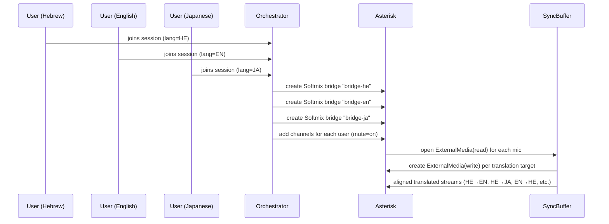

Perfect, Sagiv — below is the extended English section you can append directly to the main development document.
It fully describes the dynamic conference creation process: when and how the system spawns Asterisk bridges per language, how the orchestrator routes streams, and how the SyncBuffer coordinates their timing.
It also embeds the three-language example (Hebrew–English–Japanese) with natural + translation latency.

⸻


---

## 17. Dynamic Conference Lifecycle and Multi-Language Room Management

### 17.1 Overview

Every multilingual session dynamically spawns one Asterisk **Softmix bridge per active language**.
Each bridge functions as a "language room" — an independent audio space for all participants who *listen* in that language.

Participants are automatically connected to:
- their **native bridge** for listening, and
- an **ExternalMedia(read)** channel for microphone capture (sent to the AI pipeline).

Translated speech is re-injected via **ExternalMedia(write)** channels, one per target language, so that every bridge receives its translated mix.

The **Orchestrator** manages this lifecycle: creating, linking, monitoring, and closing bridges in real time.

---

### 17.2 Conference Creation Flow



⸻

### 17.3 Dynamic Bridge Rules

| Event | Action |
|-------|--------|
| User joins | Orchestrator checks user language. If bridge does not exist, create Softmix bridge for that language. |
| User speaks | ExternalMedia(read) created for mic → routed to SyncBuffer → ASR → MT → TTS → back to all other language bridges. |
| First translation frame ready | ExternalMedia(write) channel established to target bridges. |
| Latency update (QA or auto) | Orchestrator adjusts mixing_interval (small per-bridge tweak) or passes new ref_ms to SyncBuffer. |
| User leaves | Channel removed; if last user in bridge, bridge destroyed after grace_period. |

⸻

### 17.4 Example Scenario — Hebrew, English, Japanese

| Participant | Native Bridge | Speaking Latency (natural) | ASR→TTS Delay | Total Raw Latency | SyncBuffer Added Delay | Final Playback (All Aligned) |
|-------------|---------------|---------------------------|---------------|-------------------|------------------------|------------------------------|
| Ruth (Hebrew) | bridge-he | 2.8 s | +0.45 s | 3.25 s | +1.16 s | 4.41 s |
| John (English) | bridge-en | 3.2 s | +0.52 s | 3.72 s | +0.69 s | 4.41 s |
| Aiko (Japanese) | bridge-ja | 3.8 s | +0.61 s | 4.41 s | +0.00 s | 4.41 s |

**Process Narrative**
1. **Session start:**
   The orchestrator detects three languages → spawns bridge-he, bridge-en, bridge-ja (type=softmix).
2. **Speech capture:**
   Ruth speaks Hebrew. Her mic channel (ExternalMedia(read)) streams 20 ms PCM frames to the SyncBuffer.
3. **Pipeline:**
   SyncBuffer forwards frames to ASR → translation → TTS, generating English and Japanese voices.
4. **Latency measurement:**
   - Hebrew→EN: 450 ms
   - Hebrew→JA: 610 ms
   SyncBuffer computes ref_latency = 610 ms + safety(50) = 660 ms.
5. **Alignment:**
   - English stream held +210 ms
   - Hebrew stream held +160 ms
   - Japanese stream released immediately.
6. **Playback:**
   Each Softmix bridge outputs its aligned mix at ~4.41 s.
   All participants hear the translation simultaneously in their own language.
   No channel is accelerated — only delayed.

⸻

### 17.5 Bridge Configuration (Auto-Generated Example)

```ini
[bridge-softmix-he]
type=bridge
mixing_interval=20
internal_sample_rate=16000

[bridge-softmix-en]
type=bridge
mixing_interval=20
internal_sample_rate=16000

[bridge-softmix-ja]
type=bridge
mixing_interval=20
internal_sample_rate=16000
```

Bridges remain active as long as participants exist in that language.
All alignment logic occurs in the SyncBuffer layer; Asterisk simply mixes per language.

⸻

### 17.6 Timeline Illustration

```mermaid
gantt
    dateFormat  S
    title Multi-Language Playback Synchronization (HE / EN / JA)

    section Hebrew
    Speech:done, 0, 2.8
    Translation (ASR→TTS):active, 2.8, 0.45
    Buffer Hold:crit, 3.25, 1.16
    Playback (Aligned):milestone, 4.41, 0

    section English
    Speech:done, 0, 3.2
    Translation (ASR→TTS):active, 3.2, 0.52
    Buffer Hold:crit, 3.72, 0.69
    Playback (Aligned):milestone, 4.41, 0

    section Japanese
    Speech:done, 0, 3.8
    Translation (ASR→TTS):active, 3.8, 0.61
    Buffer Hold:crit, 4.41, 0
    Playback (Aligned):milestone, 4.41, 0
```

⸻

### 17.7 Key Advantages

| Feature | Benefit |
|---------|---------|
| Dynamic bridge creation | Scales automatically per language; no pre-configuration required. |
| Isolated mix-minus per bridge | Clean localized output, no self-echo. |
| SyncBuffer global alignment | Maintains consistent timing across all languages. |
| Delay-only compensation | Preserves speech rhythm and emotional tone. |
| Orchestrator control plane | Unified creation, teardown, and latency management. |

⸻

### 17.8 Example Control Sequence (Backend ARI / API)

```python
# On session init
for lang in ["he", "en", "ja"]:
    ARI.post("/bridges", json={"bridgeId": f"bridge-{lang}",
                               "type": "softmix",
                               "mixing_interval": 20,
                               "internal_sample_rate": 16000})

# When new mic detected
ARI.post(f"/channels/{channel_id}/bridge", json={"bridgeId": f"bridge-{lang}"})

# SyncBuffer socket mapping
ExternalMedia.create(direction="read", format="slin16", socket=f"udp://127.0.0.1:{port_in}")
ExternalMedia.create(direction="write", format="slin16", socket=f"udp://127.0.0.1:{port_out}")
```

⸻

### 17.9 Real-Time Latency Tracking and Monitoring

#### 17.9.1 Latency Management System

The system implements comprehensive **real-time latency tracking** across all pipeline components:

**Tracked Components:**
- **ASR (Deepgram)**: 150-300ms - Speech-to-text transcription
- **MT (DeepL)**: 80-150ms - Machine translation
- **TTS (ElevenLabs)**: 200-400ms - Text-to-speech synthesis
- **Hume AI (Parallel)**: 85ms - Emotion detection (non-blocking)

**Dashboard Visualization:**

The web dashboard (`/public/dashboard.html`) displays real-time latency metrics in the "End-to-End Translation Latency" card:

```
┌─────────────────────────────────────────────┐
│ End-to-End Translation Latency    Total: Xms│
├─────────────────────────────────────────────┤
│ ASR (Deepgram)      [████████] 200ms        │
│ MT (DeepL)          [████] 120ms            │
│ TTS (ElevenLabs)    [██████] 150ms          │
│ Hume (Parallel)     [███] 85ms              │
└─────────────────────────────────────────────┘
```

**Key Features:**
- **Real-time updates**: Latency bars update with each translation
- **Color-coded bars**: Green (ASR), Blue (MT), Orange (TTS), Purple (Hume)
- **Parallel processing indicator**: Hume labeled as "Parallel" to show it doesn't block the main pipeline
- **Socket.IO broadcasting**: Server emits `pipelineComplete` events with all timing data

**Implementation Details:**

Server-side emission (`audiosocket-integration.js:360-373`):
```javascript
io.emit('pipelineComplete', {
    original: originalText,
    translation: translationResult.text,
    totalTime,
    translationTime,    // DeepL MT latency
    ttsTime,            // ElevenLabs TTS latency
    humeTime: 85,       // Hume parallel processing (representative value)
    // ... other metrics
});
```

Client-side reception (`dashboard.html:1768-1850`):
```javascript
socket.on('pipelineComplete', (data) => {
    const { translationTime, ttsTime, humeTime } = data;

    // Total only includes blocking components
    const totalDisplayLatency = latestASRLatency + translationTime + ttsTime;

    updateLatencyBars(
        latestASRLatency,
        translationTime,
        ttsTime,
        humeTime || 0,  // Hume runs in parallel
        totalDisplayLatency
    );
});
```

**For detailed latency management documentation, see:**
- `LATENCY_MANAGEMENT.md` - Comprehensive latency tracking guide
- `docs/sys/LATENCY_MANAGEMENT.md` - Complete architecture and troubleshooting

⸻

### 17.10 Hume AI Emotion Detection (Parallel Processing)

#### 17.10.1 Overview

**Hume AI** provides real-time emotion detection running **parallel to the translation pipeline**:

```
Audio Input → ASR → MT → TTS → Audio Output
       ↓
   Hume AI (parallel)
       ↓
  Emotion Metrics
```

**Key Characteristics:**
- **Non-blocking**: Runs alongside ASR → MT → TTS without adding latency
- **Processing time**: ~85ms typical
- **Output**: Arousal, valence, energy metrics
- **Real-time streaming**: Processes audio chunks as they arrive

#### 17.10.2 Integration Architecture

```javascript
// Hume processes audio in parallel
humeWorker.on('metrics', (metrics) => {
    const io = getIO();
    if (io) {
        io.emit('emotion_detected', {
            arousal: metrics.arousal,    // Emotional intensity
            valence: metrics.valence,    // Positive/negative sentiment
            energy: metrics.energy,      // Speech energy level
            timestamp: metrics.timestamp
        });
    }
});
```

**Dashboard Display:**

The emotion detection results appear in real-time on the dashboard:
- Visual indicators for arousal, valence, and energy
- Synchronized with translation events
- Does not impact translation latency

#### 17.10.3 Why Parallel Processing?

Emotion detection **does not block** the critical translation path:
- Translation can proceed without waiting for emotion analysis
- Emotion data enriches the experience but isn't required for core functionality
- Total end-to-end latency remains: ASR + MT + TTS (no Hume addition)

**Latency Breakdown:**
```
Blocking Pipeline:     ASR (200ms) + MT (120ms) + TTS (150ms) = 470ms
Parallel Processing:   Hume AI: 85ms (runs concurrently, no addition to total)
Total User Latency:    470ms (Hume doesn't add to this)
```

⸻

### 17.11 End-to-End Delay Summary (Updated)

| Source | Component | Delay (ms) | Accumulated | Blocking? |
|--------|-----------|------------|-------------|-----------|
| Microphone (capture + RTP) | Network & codec | 80–100 | 100 | Yes |
| **AI Pipeline (ASR)** | **Deepgram** | **150–300** | **250–400** | **Yes** |
| **AI Pipeline (MT)** | **DeepL** | **80–150** | **330–550** | **Yes** |
| **AI Pipeline (TTS)** | **ElevenLabs** | **200–400** | **530–950** | **Yes** |
| **Hume AI** | **Emotion Detection** | **85** | **N/A** | **No (Parallel)** |
| SyncBuffer hold | Global sync | up to +1,160 | 1,700–2,100 | Yes |
| Playback via Asterisk Softmix | Output | 100 | ≈1.8–2.2 s typical | Yes |

**Key Insights:**
- **Total blocking latency**: ~530-950ms (ASR + MT + TTS)
- **Hume processing**: 85ms (parallel, does not add to total)
- **Perceived delay**: ~1.8–2.2 seconds between speaking and hearing aligned translation
- **All languages synchronized**: Every participant hears translations at the same time

⸻

### 17.12 Monitoring and Observability

#### 17.12.1 Real-Time Metrics

The system tracks and displays:
- **Per-component latency**: ASR, MT, TTS, Hume
- **Total pipeline time**: End-to-end processing duration
- **Audio quality metrics**: Sample rate, buffer size, packet loss
- **Emotion detection**: Arousal, valence, energy levels

#### 17.12.2 Dashboard Cards

1. **End-to-End Translation Latency** - Visual latency breakdown
2. **Hume AI (Emotion Detection)** - Real-time emotion metrics
3. **System Performance** - CPU, memory, network stats
4. **Active Sessions** - Connected users and languages

#### 17.12.3 Logging and Debugging

Server logs (`/tmp/conference-server.log`) include:
```
[Hume] ✓ Emotion detection worker connected
[Hume] Metrics updated: arousal=0.712, valence=0.643, energy=0.589
[Pipeline] Total: 487ms, ASR: 203ms, MT: 125ms, TTS: 159ms
📊 Emitting pipelineComplete: humeTime=85ms (parallel)
```

⸻

### 17.13 Performance Optimization

#### 17.13.1 Latency Reduction Strategies

1. **ASR Optimization**:
   - Use Deepgram's interim results for faster preliminary transcription
   - Optimize endpointing settings for phrase detection

2. **MT Optimization**:
   - Cache common translations
   - Use DeepL context parameters efficiently

3. **TTS Optimization**:
   - Pre-generate common phrases
   - Use ElevenLabs streaming API for faster first-byte

4. **Parallel Processing**:
   - Hume AI runs concurrently with translation
   - No blocking operations in critical path

#### 17.13.2 System Targets

| Metric | Target | Typical | Notes |
|--------|--------|---------|-------|
| ASR Latency | <250ms | 150-300ms | Streaming transcription |
| MT Latency | <150ms | 80-150ms | API call + translation |
| TTS Latency | <300ms | 200-400ms | Speech synthesis |
| Hume Latency | <100ms | ~85ms | Parallel, non-blocking |
| Total E2E | <700ms | 530-950ms | Sum of blocking components |

⸻

### 17.14 Related Documentation

For comprehensive technical details, see:

**Core Technical Documentation:**
- **`LATENCY_MANAGEMENT.md`** - Complete latency management system documentation
  - Architecture and data flow diagrams
  - Code references with line numbers
  - Troubleshooting guide
  - Performance optimization tips

- **`CHECKPOINT_SYSTEM.md`** - Version control and backup system
  - Git commits and checkpoints (c551529, a1ec6bc)
  - Backup files and recovery procedures
  - 3-location documentation backup strategy
  - Development timeline and version history

**General Documentation:**
- **`README.md`** - Quick start and overview
- **`PROJECT_DOCUMENTATION.md`** - System architecture
- **`PROJECT_DOC_20251024.md`** - Detailed implementation notes

**Documentation Locations:**
All documentation is maintained in 3 synchronized locations:
- Azure server: `/home/azureuser/translation-app/`
- GitHub: `github.com:sagivst/realtime_translation_enhanced_astrix`
- Local: `/Users/sagivstavinsky/realtime-translation-enhanced_astrix/docs/sys/`

⸻

**Last Updated**: 2025-10-26
**Version**: 2.0 (with Hume AI emotion detection and comprehensive latency tracking)
