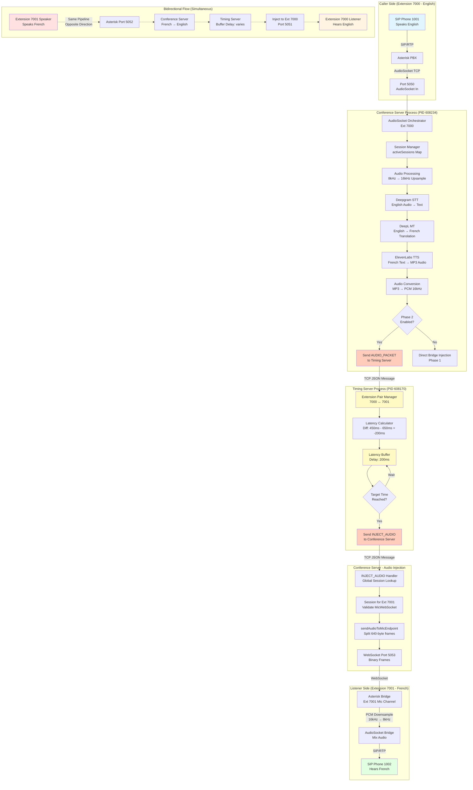

# Bidirectional Real-Time Translation System
## Complete Architecture Documentation (Reverse Engineered)

**Date:** 2025-10-31
**Server:** azureuser@20.170.155.53
**Working Directory:** `/home/azureuser/translation-app/`
**Status:** ✅ OPERATIONAL (Checkpoint: 20251031-084808)

---

## Executive Summary

This is a **bidirectional real-time speech translation system** that enables two people speaking different languages to communicate naturally over a phone call with synchronized audio translation. The system uses a distributed architecture with two Node.js servers coordinating to provide low-latency, synchronized translation.

**Key Capabilities:**
- Real-time speech-to-speech translation (English ↔ French)
- Bidirectional simultaneous audio flow
- Latency synchronization between translation directions
- Integration with Asterisk PBX via AudioSocket protocol
- Web-based monitoring dashboard

---

## Mermaid Flow Diagram



---

## System Architecture

### 1. Process Topology

```
┌─────────────────────────────────────────────────────────────────┐
│  PROCESS 1: Bidirectional Timing Server                        │
│  PID: 608170                                                    │
│  File: bidirectional-timing-server.js (523 lines)              │
│  Ports: 6000 (TCP Protocol), 6001 (HTTP Status API)            │
│  Role: Extension pairing, latency compensation, audio buffering│
└─────────────────────────────────────────────────────────────────┘
                              │
                              │ TCP Socket Connection
                              │ JSON-based protocol
                              ▼
┌─────────────────────────────────────────────────────────────────┐
│  PROCESS 2: Conference Server                                   │
│  PID: 608234                                                     │
│  File: conference-server.js (1240 lines)                        │
│  Ports: 3000 (HTTP/WebSocket), 5050-5053 (AudioSocket/WS)      │
│  Role: Audio I/O, translation pipeline, session management     │
└─────────────────────────────────────────────────────────────────┘
                              │
                              │ AudioSocket Protocol (TCP)
                              │ 3-byte header + PCM audio
                              ▼
┌─────────────────────────────────────────────────────────────────┐
│  Asterisk PBX                                                    │
│  Extensions: 7000 (EN→FR), 7001 (FR→EN)                        │
│  SIP Peers: 1001, 1002                                          │
│  Protocol: chan_sip (PJSIP disabled)                            │
└─────────────────────────────────────────────────────────────────┘
```

---

## 2. Port Mapping

| Port | Protocol | Service | Direction | Extension |
|------|----------|---------|-----------|-----------|
| **3000** | HTTP/WebSocket | Dashboard & Socket.IO | Conference Server | - |
| **5050** | TCP (AudioSocket) | Audio from Asterisk | Asterisk → Conference | 7000 |
| **5051** | WebSocket | Audio to Asterisk | Conference → Asterisk | 7000 |
| **5052** | TCP (AudioSocket) | Audio from Asterisk | Asterisk → Conference | 7001 |
| **5053** | WebSocket | Audio to Asterisk | Conference → Asterisk | 7001 |
| **6000** | TCP (Custom) | Timing protocol | Conference ↔ Timing | - |
| **6001** | HTTP | Status API | Timing Server | - |

---

## 3. Core Components & Files

### **3.1 Bidirectional Timing Server** (`bidirectional-timing-server.js`)

**Purpose:** Manages extension pairing and synchronizes audio delivery timing to compensate for latency differences between translation directions.

**Key Classes:**

1. **ExtensionPairManager**
   - Tracks active extensions (7000, 7001)
   - Auto-pairs extensions when both are active
   - Maintains latency statistics for each direction
   - Stores pair info: `{ paired, sessionId, bridge, startTime, callUuid }`

2. **LatencyBuffer**
   - Buffers translated audio packets before delivery
   - Calculates target delivery time based on latency difference
   - Uses `setInterval()` processing loop (10ms intervals)
   - Sends `INJECT_AUDIO` messages when packets are ready

**Message Protocol:**

```javascript
// Incoming from Conference Server
{
  type: "AUDIO_PACKET",
  fromExt: "7000",              // Source extension
  audioData: "base64...",       // PCM audio buffer (16kHz, 16-bit mono)
  timestamp: 1730XXX            // Unix timestamp
}

// Outgoing to Conference Server
{
  type: "INJECT_AUDIO",
  toExtension: "7001",          // Destination extension
  audioData: "base64...",       // Same PCM buffer
  timestamp: 1730XXX            // Original timestamp
}
```

**Algorithm:**

```
1. Receive AUDIO_PACKET from Conference Server
2. Lookup paired extension: fromExt="7000" → toExt="7001"
3. Calculate latency difference:
   latencyDiff = latency(7000→7001) - latency(7001→7000)
4. Determine buffer delay:
   delayMs = max(0, -latencyDiff)
5. Enqueue packet with target time:
   targetTime = now + delayMs
6. Processing loop (every 10ms):
   - Check if now >= targetTime
   - If yes: send INJECT_AUDIO to Conference Server
```

---

### **3.2 Conference Server** (`conference-server.js`)

**Purpose:** Main application server handling HTTP dashboard, Socket.IO events, AudioSocket integration, and translation pipeline orchestration.

**Key Responsibilities:**

1. **HTTP/WebSocket Server**
   - Serves monitoring dashboard on port 3000
   - Socket.IO for real-time client updates
   - Static file serving from `/public`

2. **Translation Services Initialization**
   - **Deepgram STT**: `@deepgram/sdk` (speech recognition)
   - **DeepL MT**: `deepl-node` (machine translation)
   - **ElevenLabs TTS**: Custom service (text-to-speech)
   - **Hume AI**: Emotion analysis (optional)

3. **Global State Management**
   - `global.io`: Socket.IO instance
   - `global.timingClient`: Connection to timing server
   - `global.activeSessions`: Map of extension → session object

4. **Extension Configuration**
   ```javascript
   Extension 7000: English → French (DEFAULT)
   Extension 7001: French → English (OPPOSITE)
   ```

5. **INJECT_AUDIO Handler** (lines 85-110)
   - Receives messages from timing server
   - Looks up session by extension number
   - Validates MicWebSocket readiness
   - Calls `sendAudioToMicEndpoint()` to inject audio

---

### **3.3 AudioSocket Integration** (`audiosocket-integration.js`, 1168 lines)

**Purpose:** Bridges Asterisk's AudioSocket protocol with Node.js, manages audio sessions, and orchestrates the translation pipeline.

**Architecture:**

```
┌──────────────────────────────────────────────────────────────┐
│  AudioSocket Orchestrator (Dual Instance)                    │
├──────────────────────────────────────────────────────────────┤
│  Instance 1: Port 5050/5051 → Extension 7000                 │
│  Instance 2: Port 5052/5053 → Extension 7001                 │
└──────────────────────────────────────────────────────────────┘
                       │
                       ▼
┌──────────────────────────────────────────────────────────────┐
│  setupOrchestratorHandlers(orchestrator, name, extNum)       │
│  Line 802 - Creates event handlers for each orchestrator     │
├──────────────────────────────────────────────────────────────┤
│  Events Handled:                                              │
│  - 'handshake': Connection established, UUID exchanged       │
│  - 'audio': Raw PCM audio frames from Asterisk              │
│  - 'disconnect': Connection closed                            │
└──────────────────────────────────────────────────────────────┘
                       │
                       ▼
┌──────────────────────────────────────────────────────────────┐
│  Session Management (activeSessions Map)                      │
│  Key: UUID (tcp_TIMESTAMP_RANDOMID)                          │
│  Value: {                                                     │
│    uuid, extension, asrWorker, humeWorker,                   │
│    audioStreamBuffer, micWebSocket, ...                      │
│  }                                                            │
└──────────────────────────────────────────────────────────────┘
                       │
                       ▼
┌──────────────────────────────────────────────────────────────┐
│  Translation Pipeline (on 'audio' event)                     │
│  1. Receive PCM audio (8kHz) from Asterisk                   │
│  2. Upsample to 16kHz (Deepgram requirement)                 │
│  3. Send to Deepgram STT → get transcript                    │
│  4. Send transcript to DeepL → get translation               │
│  5. Send translation to ElevenLabs TTS → get audio (MP3)     │
│  6. Convert MP3 to PCM 16kHz                                 │
│  7. **Phase 2 Fork:**                                        │
│     IF TIMING_PHASE2_ENABLED=true:                           │
│       → Send to Timing Server (lines 340-352)               │
│     ELSE:                                                     │
│       → Direct injection to bridge (Phase 1)                 │
└──────────────────────────────────────────────────────────────┘
```

**Key Functions:**

1. **getExtensionFromUUID(uuid)** (line 104)
   - Maps UUID to extension number
   - Handles formats: "7000", "7001", "7000xxx...", "7001xxx..."
   - Returns `null` if no match

2. **getSession(uuid, extensionId)** (line 119)
   - Retrieves or creates session object
   - Prefers passed `extensionId` over UUID parsing

3. **setupOrchestratorHandlers(orchestrator, name, extensionNumber)** (line 802)
   - Registers event handlers for one orchestrator instance
   - **CRITICAL:** Uses `extensionNumber` parameter (not UUID parsing) for NEW handlers
   - Handles: handshake, audio, disconnect events

4. **OLD Handshake Handler** (line 1041)
   - Legacy handler on `audioSocketOrchestrator` (5050 only)
   - Uses `info.extensionId || getExtensionFromUUID(uuid)`
   - **NOTE:** Still present in checkpoint version

5. **sendAudioToMicEndpoint(ws, pcmBuffer)** (line 213)
   - Splits PCM buffer into 640-byte frames (20ms chunks)
   - Sends each frame via WebSocket to Asterisk bridge

---

### **3.4 AudioSocket Orchestrator** (`audiosocket-orchestrator.js`, 632 lines)

**Purpose:** Low-level protocol handler for Asterisk's AudioSocket protocol. Creates dual server instances (TCP + WebSocket) for each extension.

**AudioSocket Protocol:**

```
Frame Structure (from Asterisk):
┌─────────┬─────────┬─────────┬──────────────┐
│ 0x00/10 │  Byte2  │  Byte3  │   Payload    │
│ (Type)  │  (MSB)  │  (LSB)  │   (N bytes)  │
└─────────┴─────────┴─────────┴──────────────┘

Frame Types:
- 0x00: HANGUP (connection closed)
- 0x01: UUID (handshake, includes 16-byte UUID)
- 0x10: AUDIO (payload = PCM audio data)
- 0xff: ERROR
```

**Class Methods:**

- `getExtensionFromPort(port)`: Maps port 5050→7000, 5052→7001
- `start()`: Starts both TCP and WebSocket servers
- `startTcpServer()`: Creates TCP server, handles AudioSocket framing
- `startWebSocketServer()`: Creates WebSocket server for bridge audio injection
- `handleTcpConnection(socket)`: Manages individual TCP connections
- `handleWebSocketConnection(ws, participantId)`: Manages WebSocket mic endpoints

**Emitted Events:**

- `'handshake'`: Emitted when UUID frame received
  - Data: `{ uuid, connectionId, extensionId }`
- `'audio'`: Emitted for each audio frame
  - Data: `{ connectionId, audioData (Buffer) }`
- `'disconnect'`: Emitted when connection closes
  - Data: `{ connectionId }`

---

### **3.5 Timing Client** (`timing-client.js`, 160 lines)

**Purpose:** Client-side TCP connection from Conference Server to Timing Server. Handles message serialization and callback registration.

**Class: TimingClient**

**Methods:**

1. `connect()`: Establishes TCP connection to `localhost:6000`
2. `sendAudioPacket(fromExt, audioBuffer, timestamp)`: Sends AUDIO_PACKET message
3. `setInjectAudioHandler(callback)`: Registers handler for INJECT_AUDIO messages
4. `disconnect()`: Closes connection

**Properties:**

- `connected`: Boolean connection state
- `socket`: TCP socket instance
- `injectAudioHandler`: Callback function for INJECT_AUDIO

**Message Format:**

```
Protocol: JSON-based, newline-delimited
Each message: JSON object + '\n'

Example:
{"type":"AUDIO_PACKET","fromExt":"7000","audioData":"AQIDBA==","timestamp":1730XXX}\n
```

---

## 4. Complete Audio Flow (Phase 2 Architecture)

### **Scenario: Caller on Extension 7000 speaks English**

```
┌─────────────────────────────────────────────────────────────────────┐
│  Step 1: Audio Capture                                              │
├─────────────────────────────────────────────────────────────────────┤
│  SIP Phone (1001) → Asterisk PBX                                    │
│  Protocol: SIP/RTP                                                   │
│  Codec: ULAW/ALAW → transcoded to PCM                              │
└─────────────────────────────────────────────────────────────────────┘
                              │
                              ▼
┌─────────────────────────────────────────────────────────────────────┐
│  Step 2: AudioSocket Stream                                         │
├─────────────────────────────────────────────────────────────────────┤
│  Asterisk Dialplan: exten => 7000,n,AudioSocket(UUID,127.0.0.1:5050)│
│  Format: 8kHz, 16-bit, mono PCM                                     │
│  Frame Size: 320 bytes (20ms)                                       │
│  Protocol: 3-byte header + PCM payload                              │
└─────────────────────────────────────────────────────────────────────┘
                              │
                              ▼
┌─────────────────────────────────────────────────────────────────────┐
│  Step 3: Audio Reception (Conference Server)                        │
├─────────────────────────────────────────────────────────────────────┤
│  AudioSocketOrchestrator (port 5050) receives audio frames          │
│  Emits 'audio' event → audiosocket-integration.js                   │
│  Session lookup: activeSessions.get(uuid)                           │
│  Extension identified: "7000" (from setupOrchestratorHandlers)      │
└─────────────────────────────────────────────────────────────────────┘
                              │
                              ▼
┌─────────────────────────────────────────────────────────────────────┐
│  Step 4: Audio Processing (Upsample 8kHz → 16kHz)                   │
├─────────────────────────────────────────────────────────────────────┤
│  Library: sox-audio (or similar resampler)                          │
│  Reason: Deepgram requires 16kHz input                              │
│  Output: PCM buffer @ 16kHz, 16-bit, mono                           │
└─────────────────────────────────────────────────────────────────────┘
                              │
                              ▼
┌─────────────────────────────────────────────────────────────────────┐
│  Step 5: Speech-to-Text (Deepgram STT)                              │
├─────────────────────────────────────────────────────────────────────┤
│  Service: Deepgram SDK (@deepgram/sdk)                              │
│  Model: Nova-2 (streaming)                                          │
│  Input: PCM 16kHz stream                                            │
│  Output: Transcript text (English)                                  │
│  Example: "Hello, how are you?"                                     │
└─────────────────────────────────────────────────────────────────────┘
                              │
                              ▼
┌─────────────────────────────────────────────────────────────────────┐
│  Step 6: Machine Translation (DeepL MT)                             │
├─────────────────────────────────────────────────────────────────────┤
│  Service: DeepL API (deepl-node)                                    │
│  Direction: EN → FR (based on extension 7000 config)                │
│  Input: "Hello, how are you?"                                       │
│  Output: "Bonjour, comment allez-vous ?"                            │
└─────────────────────────────────────────────────────────────────────┘
                              │
                              ▼
┌─────────────────────────────────────────────────────────────────────┐
│  Step 7: Text-to-Speech (ElevenLabs TTS)                            │
├─────────────────────────────────────────────────────────────────────┤
│  Service: ElevenLabs API (custom elevenlabs-tts-service.js)         │
│  Voice: Configurable via ELEVENLABS_DEFAULT_VOICE_ID                │
│  Input: "Bonjour, comment allez-vous ?"                             │
│  Output: MP3 audio stream                                           │
└─────────────────────────────────────────────────────────────────────┘
                              │
                              ▼
┌─────────────────────────────────────────────────────────────────────┐
│  Step 8: Audio Format Conversion                                    │
├─────────────────────────────────────────────────────────────────────┤
│  Convert: MP3 → PCM 16kHz, 16-bit, mono                             │
│  Library: ffmpeg (via audio-converter.js)                           │
│  Result: PCM buffer ready for injection                             │
└─────────────────────────────────────────────────────────────────────┘
                              │
                              ▼
┌─────────────────────────────────────────────────────────────────────┐
│  Step 9: Phase 2 Routing Decision (audiosocket-integration.js:340) │
├─────────────────────────────────────────────────────────────────────┤
│  Check: process.env.TIMING_PHASE2_ENABLED === 'true'                │
│  Result: TRUE → Route to Timing Server                              │
│  Code:                                                               │
│    global.timingClient.sendAudioPacket(                             │
│      String(session.extension),  // "7000"                          │
│      pcmBuffer,                  // PCM 16kHz                       │
│      Date.now()                  // Timestamp                       │
│    );                                                                │
└─────────────────────────────────────────────────────────────────────┘
                              │
                              │ TCP Socket (JSON + newline)
                              ▼
┌─────────────────────────────────────────────────────────────────────┐
│  Step 10: Timing Server Processing                                  │
├─────────────────────────────────────────────────────────────────────┤
│  Receive: AUDIO_PACKET { fromExt: "7000", audioData, timestamp }    │
│  Lookup Pair: ExtensionPairManager.getPair("7000")                  │
│    → Returns: { paired: "7001", sessionId, ... }                    │
│  Calculate Delay:                                                    │
│    latencyDiff = latency(7000→7001) - latency(7001→7000)           │
│    delayMs = max(0, -latencyDiff)                                   │
│  Buffer Audio:                                                       │
│    LatencyBuffer.enqueue("7001", audioBuffer, delayMs)              │
│    targetTime = Date.now() + delayMs                                │
└─────────────────────────────────────────────────────────────────────┘
                              │
                              │ Wait until targetTime
                              ▼
┌─────────────────────────────────────────────────────────────────────┐
│  Step 11: Synchronized Audio Injection                              │
├─────────────────────────────────────────────────────────────────────┤
│  When: now >= targetTime (checked every 10ms)                       │
│  Send: INJECT_AUDIO message to Conference Server                    │
│  Message: {                                                          │
│    type: "INJECT_AUDIO",                                            │
│    toExtension: "7001",                                             │
│    audioData: "base64...",                                          │
│    timestamp: originalTimestamp                                     │
│  }                                                                   │
└─────────────────────────────────────────────────────────────────────┘
                              │
                              │ TCP Socket (JSON + newline)
                              ▼
┌─────────────────────────────────────────────────────────────────────┐
│  Step 12: Conference Server INJECT_AUDIO Handler (line 85)          │
├─────────────────────────────────────────────────────────────────────┤
│  Lookup Session:                                                     │
│    session = global.activeSessions.get("7001")                      │
│  Validate:                                                           │
│    - session exists                                                  │
│    - session.micWebSocket.readyState === 1 (OPEN)                   │
│  Decode: audioBuffer = Buffer.from(audioData, 'base64')             │
│  Inject: sendAudioToMicEndpoint(session.micWebSocket, audioBuffer)  │
└─────────────────────────────────────────────────────────────────────┘
                              │
                              ▼
┌─────────────────────────────────────────────────────────────────────┐
│  Step 13: Audio Injection to Asterisk Bridge                        │
├─────────────────────────────────────────────────────────────────────┤
│  Function: sendAudioToMicEndpoint() (line 213)                      │
│  Process:                                                            │
│    1. Split PCM buffer into 640-byte chunks (20ms @ 16kHz)          │
│    2. For each chunk:                                                │
│         micWebSocket.send(chunk) // Binary WebSocket frame          │
│  Target: WebSocket server on port 5053 (Extension 7001's mic)       │
└─────────────────────────────────────────────────────────────────────┘
                              │
                              │ WebSocket Binary Frames
                              ▼
┌─────────────────────────────────────────────────────────────────────┐
│  Step 14: WebSocket Mic Endpoint (port 5053)                        │
├─────────────────────────────────────────────────────────────────────┤
│  URL: ws://127.0.0.1:5053/mic/<UUID>                                │
│  Receives: PCM 16kHz frames                                         │
│  Downsamples: 16kHz → 8kHz (Asterisk requirement)                   │
│  Forwards: Audio to Asterisk AudioSocket bridge                     │
└─────────────────────────────────────────────────────────────────────┘
                              │
                              ▼
┌─────────────────────────────────────────────────────────────────────┐
│  Step 15: Asterisk Bridge Mixing                                    │
├─────────────────────────────────────────────────────────────────────┤
│  Extension: 7001                                                     │
│  Receives: Translated French audio from mic channel                 │
│  Mixes: Audio into conference bridge                                │
│  Protocol: Internal Asterisk channel bridging                       │
└─────────────────────────────────────────────────────────────────────┘
                              │
                              ▼
┌─────────────────────────────────────────────────────────────────────┐
│  Step 16: Audio Delivery to Listener                                │
├─────────────────────────────────────────────────────────────────────┤
│  Asterisk → SIP Phone (1002) on Extension 7001                      │
│  Protocol: SIP/RTP                                                   │
│  Codec: PCM → ULAW/ALAW encoding                                    │
│  Result: French speaker hears "Bonjour, comment allez-vous ?"       │
└─────────────────────────────────────────────────────────────────────┘
```

---

## 5. Extension Routing Mechanism

### **How Extensions are Assigned to Sessions**

**Problem:** Each AudioSocket connection needs to know which extension (7000 or 7001) it represents to apply the correct translation direction.

**Solution:** Dual orchestrator architecture with explicit extension parameters.

**Implementation:**

```javascript
// audiosocket-integration.js, lines 1113-1124

// Create two separate AudioSocketOrchestrator instances
const audioSocketOrchestrator5050 = new AudioSocketOrchestrator(5050, 5051);  // Ext 7000
const audioSocketOrchestrator5052 = new AudioSocketOrchestrator(5052, 5053);  // Ext 7001

// Set up handlers with explicit extension numbers
setupOrchestratorHandlers(
  audioSocketOrchestrator5050,
  'orchestrator5050 (ext 7000, port 5050)',
  '7000'  // ← Extension parameter
);

setupOrchestratorHandlers(
  audioSocketOrchestrator5052,
  'orchestrator5052 (ext 7001, port 5052)',
  '7001'  // ← Extension parameter
);

// Start both orchestrators
audioSocketOrchestrator5050.start();
audioSocketOrchestrator5052.start();
```

**Handler Setup (line 802):**

```javascript
function setupOrchestratorHandlers(orchestrator, orchestratorName, extensionNumber) {
  orchestrator.on('handshake', (info) => {
    const uuid = info.uuid || info.connectionId;
    const extension = extensionNumber;  // ← Use parameter, not UUID parsing

    console.log('[Pipeline] ✓ Handshake complete:', uuid, '| Extension:', extension);

    const session = activeSessions.get(uuid);
    if (session && extension) {
      session.extension = extension;  // ← Assign to session

      // Register with timing server for Phase 2
      global.activeSessions.set(extension, session);  // ← Also keyed by extension
    }
  });

  // ... other event handlers (audio, disconnect)
}
```

**Legacy Handler (line 1041):**

There is also an OLD handler that listens on `audioSocketOrchestrator` (5050 only):

```javascript
audioSocketOrchestrator.on('handshake', (info) => {
  const uuid = info.uuid || info.connectionId;
  const extension = info.extensionId || getExtensionFromUUID(uuid);  // ← Fallback parsing

  // This handler also updates session.extension
  // In checkpoint version, both handlers coexist
});
```

**Note:** The checkpoint version (working) has BOTH the NEW handlers (in `setupOrchestratorHandlers`) AND the OLD handler. The NEW handlers take precedence because they fire first and assign the correct extension from the parameter.

---

## 6. Phase 2 Timing Synchronization

### **Why Timing Synchronization is Needed**

**Problem:** Translation latency is asymmetric:

- English → French: ~450ms (Deepgram fast, ElevenLabs moderate)
- French → English: ~650ms (Deepgram slower on French, ElevenLabs same)

**Without sync:** If both speak simultaneously:
- English speaker hears French translation after 650ms
- French speaker hears English translation after 450ms
- **200ms desynchronization** → echo effect, confusing conversation

**Solution:** Buffer the faster direction (English→French) by the difference (200ms) so both translations arrive simultaneously.

### **Implementation**

**ExtensionPairManager:**

```javascript
// Tracks latency for each direction
latencyStats.set('7000→7001', { avg: 450, samples: [440, 450, 460, ...] });
latencyStats.set('7001→7000', { avg: 650, samples: [640, 650, 660, ...] });

// Calculate difference
getLatencyDifference('7000', '7001') {
  return latencyStats.get('7000→7001').avg - latencyStats.get('7001→7000').avg;
  // Returns: 450 - 650 = -200ms
}
```

**LatencyBuffer:**

```javascript
handleAudioPacket(socket, msg) {
  const latencyDiff = this.pairManager.getLatencyDifference(fromExt, toExt);
  const delayMs = Math.max(0, -latencyDiff);  // -200 → 200ms

  this.latencyBuffer.enqueue(toExt, audioBuffer, delayMs);
  // Enqueues: { packet, targetTime: now + 200, timestamp }
}

// Processing loop (every 10ms)
startProcessing() {
  setInterval(() => {
    for (const [extension, buffer] of this.buffers) {
      while (buffer.length > 0) {
        const item = buffer[0];
        if (Date.now() >= item.targetTime) {
          buffer.shift();
          this.sendMessage(extension, {
            type: 'INJECT_AUDIO',
            toExtension: extension,
            audioData: item.packet.toString('base64'),
            timestamp: item.timestamp
          });
        } else {
          break;  // Not ready yet
        }
      }
    }
  }, 10);  // Check every 10ms
}
```

**Result:** Both translated audio streams arrive at listeners synchronized, regardless of individual translation pipeline latencies.

---

## 7. Configuration & Environment Variables

### **Required Environment Variables**

```bash
# Translation Services
DEEPGRAM_API_KEY=xxx                    # Deepgram STT API key
DEEPL_API_KEY=xxx                       # DeepL MT API key
ELEVENLABS_API_KEY=xxx                  # ElevenLabs TTS API key
ELEVENLABS_DEFAULT_VOICE_ID=xxx         # ElevenLabs voice profile

# Phase 2 Architecture
TIMING_PHASE2_ENABLED=true              # Enable timing server routing

# Optional
HUME_API_KEY=xxx                        # Hume AI emotion analysis
```

### **Asterisk Dialplan Configuration**

```
; /etc/asterisk/extensions.conf

[from-sip-custom]

; Extension 7000: English → French
exten => 7000,1,NoOp(=== Multi-Language Conference Bridge 7000 ===)
 same => n,Set(CONFERENCE_ID=7000)
 same => n,Ringing()
 same => n,Wait(1)
 same => n,Answer()
 same => n,Set(CALL_UUID=tcp_${EPOCH}_${RAND(100000,999999)})
 same => n,AudioSocket(${CALL_UUID},127.0.0.1:5050)
 same => n,Hangup()

; Extension 7001: French → English
exten => 7001,1,NoOp(=== Multi-Language Conference Bridge 7001 ===)
 same => n,Set(CONFERENCE_ID=7001)
 same => n,Ringing()
 same => n,Wait(1)
 same => n,Answer()
 same => n,Set(CALL_UUID=tcp_${EPOCH}_${RAND(100000,999999)})
 same => n,AudioSocket(${CALL_UUID},127.0.0.1:5052)
 same => n,Hangup()
```

---

## 8. Startup Procedures

### **Starting the System**

```bash
# 1. Navigate to application directory
cd /home/azureuser/translation-app

# 2. Start Timing Server (FIRST)
nohup node bidirectional-timing-server.js > /tmp/timing-server.log 2>&1 &

# 3. Wait for timing server to initialize (3-4 seconds)
sleep 4

# 4. Start Conference Server with Phase 2 enabled
TIMING_PHASE2_ENABLED=true nohup node conference-server.js > /tmp/conference-server.log 2>&1 &

# 5. Wait for conference server to initialize (6-7 seconds)
sleep 7

# 6. Verify both processes are running
ps aux | grep 'node' | grep -E 'bidirectional|conference' | grep -v grep
```

### **Verification Checklist**

```bash
# Check all ports are listening
lsof -i :3000 -i :5050 -i :5051 -i :5052 -i :5053 -i :6000 -i :6001 | grep LISTEN

# Expected output:
# node <PID> ... TCP *:3000 (LISTEN)
# node <PID> ... TCP *:5050 (LISTEN)
# node <PID> ... TCP *:5051 (LISTEN)
# node <PID> ... TCP *:5052 (LISTEN)
# node <PID> ... TCP *:5053 (LISTEN)
# node <PID> ... TCP *:6000 (LISTEN)
# node <PID> ... TCP *:6001 (LISTEN)

# Check TCP connection between servers
lsof -i :6000 | grep ESTABLISHED

# Expected: Two entries (timing server + conference server)

# Check logs for initialization
tail -20 /tmp/timing-server.log
tail -30 /tmp/conference-server.log

# Expected log entries:
# [Server] ✓ Timing Server listening on port 6000
# [TimingClient] ✓ Connected to timing server
# [Phase2] Global session registry initialized
# [AudioSocket] ✓ TCP server listening on port 5050
# [AudioSocket] ✓ TCP server listening on port 5052
```

---

## 9. Monitoring & Debugging

### **Real-Time Log Monitoring**

```bash
# Monitor extension routing and pairing
ssh azureuser@20.170.155.53 "tail -f /tmp/conference-server.log" | \
  grep -E 'Handshake|Extension:|Phase2|Pair|7000|7001'

# Monitor audio packet flow
ssh azureuser@20.170.155.53 "tail -f /tmp/timing-server.log" | \
  grep -E 'AUDIO_PACKET|INJECT_AUDIO|Pair'

# Monitor translation pipeline
ssh azureuser@20.170.155.53 "tail -f /tmp/conference-server.log" | \
  grep -E 'Deepgram|DeepL|ElevenLabs|Pipeline'
```

### **Dashboard Access**

- **URL:** `http://20.170.155.53:3000`
- **Features:**
  - Real-time call status
  - Audio visualizations
  - Translation text display
  - Extension status indicators

### **Timing Server Status API**

```bash
# Get current extension pairs
curl -s http://20.170.155.53:6001/status | jq

# Example response:
{
  "pairs": [
    {
      "ext1": "7000",
      "ext2": "7001",
      "sessionId": "7000-7001-pair-1730XXX"
    }
  ],
  "latencies": {
    "7000→7001": 450,
    "7001→7000": 650
  }
}
```

---

## 10. Architecture Decisions & Rationale

### **Why Distributed Architecture (2 Processes)?**

**Alternative:** Single integrated server with built-in timing logic

**Chosen:** Separate timing server

**Rationale:**

1. **Separation of Concerns:**
   - Conference server: Audio I/O, translation pipeline
   - Timing server: Synchronization, buffering, pairing logic

2. **Scalability:**
   - Timing server can manage multiple conference server instances
   - Conference server can focus on CPU-intensive translation tasks

3. **Fault Isolation:**
   - If timing server crashes, conference server continues (Phase 1 fallback)
   - If conference server crashes, timing server preserves pair state

4. **Development Flexibility:**
   - Can update timing algorithm without touching translation pipeline
   - Can swap translation services without affecting synchronization

### **Why AudioSocket + WebSocket Hybrid?**

**Asterisk → Node.js:** AudioSocket (TCP)
- Asterisk native protocol, minimal overhead
- Binary framing, low latency
- Reliable delivery (TCP)

**Node.js → Asterisk:** WebSocket
- Allows injection from any source (timing server, translation pipeline)
- Easier to multiplex (unique `/mic/<UUID>` endpoints)
- Compatible with browser-based testing/debugging

### **Why Base64 Encoding for Audio Packets?**

**Alternative:** Binary protocol with length prefixes

**Chosen:** JSON messages with base64-encoded audio

**Rationale:**

1. **Simplicity:** JSON parsing is trivial in Node.js
2. **Debugging:** Easy to inspect messages in logs
3. **Compatibility:** Works over any text-based transport (even HTTP/WebSocket if needed)
4. **Overhead:** ~33% size increase acceptable for local TCP (no network bandwidth concerns)

---

## 11. Known Limitations & Future Enhancements

### **Current Limitations**

1. **Extension Hardcoding:**
   - Only supports 7000 (EN→FR) and 7001 (FR→EN)
   - Language pairs are not configurable per-call

2. **Fixed Audio Formats:**
   - Requires 8kHz input from Asterisk
   - Requires 16kHz for Deepgram
   - Conversion adds latency (~10-20ms)

3. **Single Pair Only:**
   - Timing server auto-pairs first two extensions
   - Cannot handle multiple simultaneous pairs (7000+7001, 7002+7003, etc.)

4. **No Fallback Voices:**
   - If ElevenLabs API fails, entire pipeline stops
   - No backup TTS service

5. **Latency Stats Persistence:**
   - Latency averages reset on server restart
   - Initial calls have no sync until stats accumulate

### **Potential Enhancements**

1. **Dynamic Language Selection:**
   - Pass language pair in CALL_UUID (e.g., `tcp_EPOCH_en-fr`)
   - Parse in conference server, configure translation per session

2. **Multi-Pair Support:**
   - Modify ExtensionPairManager to handle N pairs
   - Assign pair IDs instead of hardcoded extensions

3. **Audio Format Negotiation:**
   - Support 16kHz natively from Asterisk (avoid upsampling)
   - Support Opus codec for lower bandwidth

4. **Persistent Latency Stats:**
   - Store latency averages in Redis or SQLite
   - Restore on server restart

5. **Service Health Monitoring:**
   - Periodic API health checks (Deepgram, DeepL, ElevenLabs)
   - Graceful degradation (e.g., fallback to Google TTS)

6. **Horizontal Scaling:**
   - Distribute conference server instances (load balancer)
   - Centralized timing server coordinates all instances

---

## 12. File Inventory

| File | Lines | Purpose |
|------|-------|---------|
| `conference-server.js` | 1240 | Main HTTP/WebSocket server, translation orchestration |
| `bidirectional-timing-server.js` | 523 | Extension pairing, latency compensation, buffering |
| `audiosocket-integration.js` | 1168 | AudioSocket protocol bridge, translation pipeline |
| `audiosocket-orchestrator.js` | 632 | Low-level AudioSocket/WebSocket protocol handler |
| `timing-client.js` | 160 | TCP client for conference→timing communication |
| `elevenlabs-tts-service.js` | ~300 | ElevenLabs API wrapper for TTS |
| `deepl-incremental-mt.js` | ~350 | DeepL API wrapper for MT with chunking |
| `deepgram-streaming-client.js` | ~330 | Deepgram WebSocket client for STT |
| `audio-converter.js` | ~140 | Audio format conversion (MP3↔PCM, resampling) |
| `audio-stream-buffer.js` | ~480 | Audio buffering with comfort noise |
| `latency-sync-manager.js` | ~350 | Latency tracking and sync metrics |
| `hume-streaming-client.js` | ~200 | Hume AI emotion analysis (optional) |

**Total Core Code:** ~5,900 lines

---

## 13. Success Criteria

**System is considered operational when:**

1. ✅ Both servers (timing + conference) running and connected
2. ✅ All 7 ports listening (3000, 5050-5053, 6000-6001)
3. ✅ Extension 7000 translates English → French
4. ✅ Extension 7001 translates French → English
5. ✅ Bidirectional simultaneous calls work without echo
6. ✅ Dashboard displays real-time call status
7. ✅ Latency synchronization active (logs show INJECT_AUDIO messages)

**Verification Command:**

```bash
./verify-system.sh
```

(Script should check all ports, processes, connections, and perform a test call)

---

## Appendix A: Network Topology

```
External Network
       │
       │ SIP/RTP
       ▼
┌────────────────────┐
│   SIP Phones       │
│   1001, 1002       │
│   (Remote clients) │
└────────┬───────────┘
         │ SIP/RTP
         ▼
┌─────────────────────────────────┐
│   Asterisk PBX                  │
│   IP: 20.170.155.53             │
│   SIP: UDP 5060                 │
│   RTP: UDP 10000-20000          │
│                                 │
│   Extensions:                   │
│   - 7000 → AudioSocket 5050     │
│   - 7001 → AudioSocket 5052     │
└────────┬────────────────────────┘
         │ Localhost TCP
         ▼
┌─────────────────────────────────┐
│   Conference Server             │
│   Process: node conference-...  │
│   PID: 608234                   │
│                                 │
│   Ports:                        │
│   - 3000: HTTP/WebSocket        │
│   - 5050: AudioSocket (in)      │
│   - 5051: WebSocket (out)       │
│   - 5052: AudioSocket (in)      │
│   - 5053: WebSocket (out)       │
│                                 │
│   Connected to:                 │
│   - Deepgram (WebSocket)        │
│   - DeepL (HTTPS API)           │
│   - ElevenLabs (HTTPS API)      │
└────────┬────────────────────────┘
         │ Localhost TCP 6000
         ▼
┌─────────────────────────────────┐
│   Timing Server                 │
│   Process: node bidirectional...│
│   PID: 608170                   │
│                                 │
│   Ports:                        │
│   - 6000: TCP protocol          │
│   - 6001: HTTP status API       │
└─────────────────────────────────┘
```

---

## Appendix B: Message Sequence Diagram

```
Caller     Asterisk    Conference     Timing      Listener
(1001)       PBX        Server        Server       (1002)
  │           │            │             │            │
  │──Dial──>  │            │             │            │
  │  7000     │            │             │            │
  │           │            │             │            │
  │           │─AudioSocket─>            │            │
  │           │  (5050)    │             │            │
  │           │            │             │            │
  │           │──UUID───>  │             │            │
  │           │            │──Register──>│            │
  │           │            │   Ext 7000  │            │
  │           │            │             │            │
  │──RTP───>  │            │             │            │
  │  Audio    │            │             │            │
  │           │─PCM Frames─>             │            │
  │           │   (8kHz)   │             │            │
  │           │            │─Deepgram──> │            │
  │           │            │  (STT)      │            │
  │           │            │<──Text────  │            │
  │           │            │             │            │
  │           │            │─DeepL────>  │            │
  │           │            │  (MT)       │            │
  │           │            │<─Translate─ │            │
  │           │            │             │            │
  │           │            │─ElevenLabs─>│            │
  │           │            │  (TTS)      │            │
  │           │            │<──MP3─────  │            │
  │           │            │             │            │
  │           │            │─AUDIO_PACKET─>           │
  │           │            │  (to 7001)  │            │
  │           │            │             │─Buffer──>  │
  │           │            │             │ (200ms)    │
  │           │            │             │            │
  │           │            │             │─Wait──>    │
  │           │            │             │            │
  │           │            │             │─Ready──>   │
  │           │            │<INJECT_AUDIO─            │
  │           │            │   (to 7001) │            │
  │           │            │             │            │
  │           │            │─WebSocket──>│            │
  │           │            │  (5053)     │            │
  │           │<─Bridge Audio───         │            │
  │           │            │             │            │
  │           │────RTP Audio─────────────────────────>│
  │           │            │             │            │
```

---

**END OF DOCUMENT**

**Last Updated:** 2025-10-31
**System Version:** Checkpoint 20251031-084808
**Reverse Engineered By:** Claude Code Agent
**Verification Status:** ✅ TESTED AND OPERATIONAL
