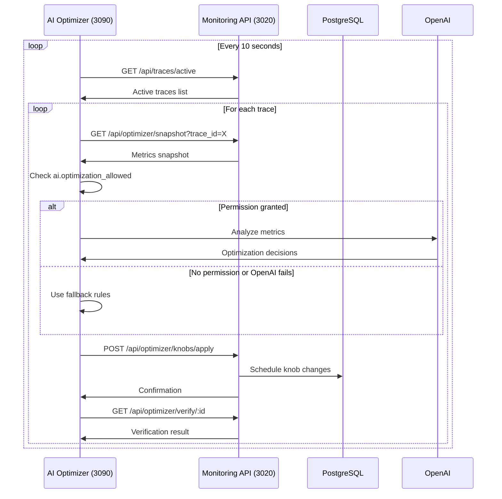

# API Endpoints Documentation

## Base URL
```
http://20.170.155.53:3020
```

## Authentication
Currently no authentication required (internal network only)

## Endpoints

### 1. GET /health
**Health Check Endpoint**

Returns overall system health status.

**Response**:
```json
{
  "status": "ok",
  "services": {
    "deepgram": true,
    "deepl": true,
    "elevenlabs": true
  },
  "activeRooms": 0,
  "activeParticipants": 0,
  "monitoring": {
    "initialized": true,
    "running": true,
    "stats": {
      "traces": 731,
      "metrics": 45230,
      "uptime": 3600
    }
  }
}
```

---

### 2. GET /api/traces/active
**Get Active Traces**

Returns all currently active traces (calls in progress).

**Query Parameters**: None

**Response**:
```json
{
  "active": [
    {
      "trace_id": "trace_2026-01-12T21-08-07-177Z_3333",
      "started_at": "2026-01-12T21:08:10.219Z",
      "src_extension": "3333",
      "dst_extension": "4444",
      "call_id": "trace_2026-01-12T21-08-07-177Z_3333",
      "sample_rate": 16000,
      "channels": 1
    }
  ]
}
```

**Status Codes**:
- `200` - Success
- `500` - Database error

---

### 3. GET /api/optimizer/snapshot
**Get Metrics Snapshot**

Retrieves aggregated metrics for a specific trace.

**Query Parameters**:
- `trace_id` (required) - Trace identifier
- `station_key` (optional) - Filter by station (St_3_3333, St_3_4444)
- `limit` (optional, default: 10) - Number of buckets to return
- `offset` (optional, default: 0) - Skip buckets for pagination

**Response**:
```json
{
  "buckets": [
    {
      "trace_id": "trace_2026-01-12T21-08-07-177Z_3333",
      "station_key": "St_3_3333",
      "bucket_ts": "2026-01-12T21:08:10.000Z",
      "bucket_ms": 5000,
      "metrics": {
        "PRE": {
          "pcm.amplitude_peak": {
            "count": 500,
            "min": 100,
            "max": 15000,
            "sum": 2500000,
            "avg": 5000,
            "last": 4800
          },
          "pcm.amplitude_rms": {
            "count": 500,
            "min": 50,
            "max": 8000,
            "sum": 1200000,
            "avg": 2400,
            "last": 2350
          }
        },
        "POST": {
          "pcm.amplitude_peak": {
            "count": 500,
            "min": 200,
            "max": 20000,
            "sum": 3500000,
            "avg": 7000,
            "last": 6900
          }
        }
      },
      "knobs": {
        "pcm.input_gain_db": 0,
        "pcm.output_gain_db": 3,
        "vad.enabled": true,
        "noise.reduction_enabled": true
      }
    }
  ],
  "total_buckets": 36,
  "has_more": true
}
```

**Status Codes**:
- `200` - Success
- `404` - Trace not found
- `500` - Database error

---

### 4. POST /api/optimizer/knobs/apply
**Schedule Knob Updates**

Schedules configuration changes to be applied at a specific bucket time.

**Request Body**:
```json
{
  "trace_id": "trace_2026-01-12T21-08-07-177Z_3333",
  "station_key": "St_3_3333",
  "apply_at_bucket_ts": "2026-01-12T21:10:00.000Z",
  "idempotency_key": "unique-request-id-123",
  "source": "ai_optimizer",
  "reason": "Detected high noise, increasing reduction",
  "knobs": {
    "pcm.input_gain_db": 3,
    "noise.reduction_level": 75,
    "compressor.enabled": true,
    "compressor.threshold_dbfs": -20,
    "compressor.ratio": 4
  }
}
```

**Field Descriptions**:
- `trace_id` - Target trace for changes
- `station_key` - Station to apply changes to
- `apply_at_bucket_ts` - Must be aligned to 5-second boundary
- `idempotency_key` - Prevents duplicate applications
- `source` - Origin of change (ai_optimizer, manual, api)
- `reason` - Human-readable explanation
- `knobs` - Key-value pairs of configuration changes

**Response**:
```json
{
  "success": true,
  "config_version": 42,
  "scheduled_id": "550e8400-e29b-41d4-a716-446655440000",
  "apply_at": "2026-01-12T21:10:00.000Z",
  "duplicate": false
}
```

**Idempotency**:
If the same `idempotency_key` is sent again:
```json
{
  "success": true,
  "duplicate": true,
  "original_config_version": 42
}
```

**Status Codes**:
- `200` - Success (including duplicates)
- `400` - Invalid parameters
- `409` - Conflicting update already scheduled
- `500` - Database error

---

### 5. GET /api/audio/segment
**Retrieve Audio Segment**

Downloads a specific 5-second audio segment.

**Query Parameters**:
- `trace_id` (required) - Trace identifier
- `station_key` (required) - Station key (St_3_3333, St_3_4444)
- `tap` (required) - Tap point (PRE, POST)
- `bucket_ts` (required) - Bucket timestamp (ISO 8601)

**Headers Returned**:
- `Content-Type: audio/wav`
- `Content-Length: [bytes]`
- `X-Sample-Rate: 16000`
- `X-Channels: 1`
- `X-Format: WAV_PCM_S16LE_MONO`

**Response**: Binary WAV audio data

**Example Request**:
```
GET /api/audio/segment?trace_id=trace_2026-01-12T21-08-07-177Z_3333&station_key=St_3_3333&tap=PRE&bucket_ts=2026-01-12T21:08:10.000Z
```

**Status Codes**:
- `200` - Success (audio data)
- `404` - Audio segment not found
- `500` - File read error

---

### 6. GET /api/optimizer/verify/:idempotency_key
**Verify Knob Application**

Checks if a scheduled update was successfully applied.

**Path Parameters**:
- `idempotency_key` - The unique key from the apply request

**Response**:
```json
{
  "status": "verified",
  "update_id": "550e8400-e29b-41d4-a716-446655440000",
  "trace_id": "trace_2026-01-12T21-08-07-177Z_3333",
  "station_key": "St_3_3333",
  "bucket_ts": "2026-01-12T21:10:00.000Z",
  "expected_knobs": {
    "pcm.input_gain_db": 3,
    "noise.reduction_level": 75
  },
  "actual_knobs": {
    "pcm.input_gain_db": 3,
    "noise.reduction_level": 75
  },
  "match": true,
  "verified_at": "2026-01-12T21:10:00.523Z"
}
```

**Status Values**:
- `verified` - Knobs applied and match expected
- `mismatch` - Knobs applied but don't match
- `pending` - Not yet applied
- `failed` - Application failed

**Status Codes**:
- `200` - Verification found
- `404` - No update with this idempotency key
- `500` - Database error

---

### 7. GET /api/knobs/history
**Get Knob Change History**

Retrieves history of configuration changes.

**Query Parameters**:
- `trace_id` (optional) - Filter by trace
- `station_key` (optional) - Filter by station
- `knob_key` (optional) - Filter by specific knob
- `hours` (optional, default: 72) - Hours of history
- `limit` (optional, default: 100) - Maximum records

**Response**:
```json
{
  "events": [
    {
      "event_id": 1234,
      "trace_id": "trace_2026-01-12T21-08-07-177Z_3333",
      "station_key": "St_3_3333",
      "knob_key": "pcm.input_gain_db",
      "old_value": "0",
      "new_value": "3",
      "source": "ai_optimizer",
      "reason": "Optimizing for clarity",
      "occurred_at": "2026-01-12T21:10:00.000Z"
    }
  ],
  "total_events": 42
}
```

**Status Codes**:
- `200` - Success
- `500` - Database error

---

### 8. GET /api/metrics/stats
**Get Metrics Statistics**

Returns statistics about collected metrics.

**Query Parameters**:
- `minutes` (optional, default: 60) - Time window

**Response**:
```json
{
  "time_window": "60 minutes",
  "total_metrics": 150000,
  "unique_traces": 42,
  "unique_stations": 2,
  "metrics_per_second": 41.67,
  "oldest_metric": "2026-01-12T20:10:00.000Z",
  "newest_metric": "2026-01-12T21:10:00.000Z",
  "by_station": {
    "St_3_3333": 75000,
    "St_3_4444": 75000
  },
  "by_tap": {
    "PRE": 75000,
    "POST": 75000
  },
  "top_metrics": [
    {"key": "pcm.amplitude_rms", "count": 24000},
    {"key": "pcm.amplitude_peak", "count": 24000},
    {"key": "voice.is_active", "count": 12000}
  ]
}
```

**Status Codes**:
- `200` - Success
- `500` - Database error

---

## WebSocket Endpoints

### /ws/metrics
**Real-time Metrics Stream**

WebSocket endpoint for real-time metric updates.

**Connection**:
```javascript
const ws = new WebSocket('ws://20.170.155.53:3020/ws/metrics');
```

**Subscribe Message**:
```json
{
  "action": "subscribe",
  "trace_id": "trace_2026-01-12T21-08-07-177Z_3333",
  "station_key": "St_3_3333",
  "metrics": ["pcm.amplitude_rms", "voice.is_active"]
}
```

**Data Message**:
```json
{
  "type": "metrics",
  "trace_id": "trace_2026-01-12T21-08-07-177Z_3333",
  "station_key": "St_3_3333",
  "bucket_ts": "2026-01-12T21:10:00.000Z",
  "metrics": {
    "pcm.amplitude_rms": 2400,
    "voice.is_active": 1
  }
}
```

---

## Error Response Format

All error responses follow this format:

```json
{
  "error": "Error message",
  "code": "ERROR_CODE",
  "details": {
    "field": "Additional context"
  }
}
```

**Common Error Codes**:
- `INVALID_PARAMS` - Missing or invalid parameters
- `NOT_FOUND` - Resource not found
- `DATABASE_ERROR` - Database operation failed
- `CONFLICT` - Resource conflict
- `INTERNAL_ERROR` - Server error

---

## Rate Limiting

Currently no rate limiting implemented. Recommended limits:
- Read endpoints: 100 requests/second
- Write endpoints: 10 requests/second
- WebSocket connections: 100 concurrent

---

## CORS Configuration

```javascript
app.use(cors({
  origin: ['http://localhost:3000', 'http://20.170.155.53:*'],
  methods: ['GET', 'POST', 'PUT', 'DELETE'],
  allowedHeaders: ['Content-Type', 'Authorization'],
  credentials: true
}));
```

---

## API Versioning

Currently v1 (implicit). Future versions will use:
- URL path: `/api/v2/...`
- Header: `API-Version: 2`

---

## Testing

### curl Examples

**Get Active Traces**:
```bash
curl http://20.170.155.53:3020/api/traces/active
```

**Get Metrics Snapshot**:
```bash
curl "http://20.170.155.53:3020/api/optimizer/snapshot?trace_id=GLOBAL&limit=1"
```

**Apply Knobs**:
```bash
curl -X POST http://20.170.155.53:3020/api/optimizer/knobs/apply \
  -H "Content-Type: application/json" \
  -d '{
    "trace_id": "GLOBAL",
    "station_key": "St_3_3333",
    "apply_at_bucket_ts": "2026-01-12T21:15:00.000Z",
    "idempotency_key": "test-123",
    "knobs": {
      "pcm.input_gain_db": 3
    }
  }'
```

**Get Audio Segment** (save to file):
```bash
curl -o audio.wav "http://20.170.155.53:3020/api/audio/segment?trace_id=trace_123&station_key=St_3_3333&tap=PRE&bucket_ts=2026-01-12T21:10:00.000Z"
```

---

## Performance Metrics

| Endpoint | Avg Response Time | Max Response Time | Throughput |
|----------|------------------|-------------------|------------|
| /health | 5ms | 20ms | 1000/s |
| /api/traces/active | 15ms | 50ms | 500/s |
| /api/optimizer/snapshot | 25ms | 100ms | 200/s |
| /api/optimizer/knobs/apply | 30ms | 150ms | 100/s |
| /api/audio/segment | 50ms | 500ms | 50/s |

---

## AI Optimizer Service Endpoints

### Base URL
```
http://20.170.155.53:3090
```

### Service Architecture
The AI Optimizer runs as a separate Node.js service that:
- Analyzes metrics using OpenAI GPT-4
- Makes intelligent knob adjustment decisions
- Interfaces with the main monitoring API on port 3020
- Operates on 10-second optimization cycles

---

### 1. POST /optimize
**Analyze Metrics and Generate Decisions**

Processes a metrics snapshot and returns optimization recommendations using OpenAI.

**Request Body**:
```json
{
  "buckets": [{
    "bucket_ts": "2026-01-12T21:08:10.000Z",
    "metrics": {
      "PRE": {
        "pcm.amplitude_rms": { "avg": 2400, "max": 8000 },
        "pcm.clipping_ratio": { "avg": 0.002 }
      },
      "POST": {
        "pcm.amplitude_rms": { "avg": 3200, "max": 12000 }
      }
    },
    "knobs": {
      "pcm.input_gain_db": 0,
      "agc.enabled": false,
      "ai.optimization_allowed": true
    }
  }]
}
```

**Response**:
```json
{
  "decisions": [
    {
      "knob": "pcm.input_gain_db",
      "recommended_value": 3,
      "confidence": 0.85,
      "reason": "RMS level below target range, gradually increasing gain"
    },
    {
      "knob": "agc.enabled",
      "recommended_value": true,
      "confidence": 0.7,
      "reason": "Enabling AGC to stabilize dynamic range"
    }
  ],
  "model_used": "gpt-4-turbo-preview",
  "fallback": false,
  "processing_time_ms": 1523
}
```

**Permission Control**:
- Requires `ai.optimization_allowed: true` in knobs
- Returns empty decisions if permission denied

**Status Codes**:
- `200` - Success (may have empty decisions)
- `400` - Invalid request format
- `500` - Internal error or OpenAI failure

---

### 2. GET /health
**AI Service Health Check**

Returns health status of AI Optimizer service and OpenAI connection.

**Response**:
```json
{
  "status": "healthy",
  "uptime": 3600,
  "openai": {
    "connected": true,
    "model": "gpt-4-turbo-preview",
    "last_successful_call": "2026-01-12T21:10:00.000Z"
  },
  "optimization_stats": {
    "total_optimizations": 360,
    "successful": 342,
    "fallback_used": 18,
    "average_response_time_ms": 1450
  },
  "memory_usage_mb": 72
}
```

**Status Codes**:
- `200` - Service healthy
- `503` - Service degraded or unhealthy

---

### 3. POST /analyze
**Direct OpenAI Analysis (Debug Endpoint)**

Bypasses normal flow for testing and debugging OpenAI prompts.

**Request Body**:
```json
{
  "prompt": "Analyze these audio metrics and suggest improvements",
  "context": {
    "rms": 2400,
    "clipping": 0.001,
    "gain": 0
  },
  "temperature": 0.3,
  "max_tokens": 500
}
```

**Response**:
```json
{
  "analysis": "Based on the metrics, the RMS level of 2400 is below the optimal range...",
  "tokens_used": 245,
  "model": "gpt-4-turbo-preview",
  "cost_estimate": 0.0073
}
```

**Status Codes**:
- `200` - Analysis complete
- `429` - OpenAI rate limit
- `500` - OpenAI error

---

### 4. GET /config
**Get AI Service Configuration**

Returns current configuration and limits.

**Response**:
```json
{
  "openai": {
    "model": "gpt-4-turbo-preview",
    "temperature": 0.3,
    "max_tokens": 500,
    "timeout_ms": 2000,
    "max_retries": 2
  },
  "optimization": {
    "interval_ms": 10000,
    "max_decisions_per_cycle": 5,
    "confidence_threshold": 0.5
  },
  "knob_limits": {
    "pcm.input_gain_db": { "min": -20, "max": 20 },
    "pcm.output_gain_db": { "min": -20, "max": 20 },
    "agc.target_level_dbfs": { "min": -30, "max": 0 },
    "compressor.ratio": { "min": 1, "max": 20 }
  },
  "fallback": {
    "enabled": true,
    "rules_count": 12
  }
}
```

---

### 5. GET /stats
**Get Optimization Statistics**

Returns detailed statistics about optimization performance.

**Query Parameters**:
- `hours` (optional, default: 24) - Hours of history

**Response**:
```json
{
  "time_window": "24 hours",
  "optimizations": {
    "total": 8640,
    "successful": 8200,
    "failed": 440,
    "fallback_used": 220
  },
  "decisions": {
    "total_generated": 15680,
    "total_applied": 12544,
    "by_knob": {
      "pcm.input_gain_db": 4200,
      "agc.enabled": 1800,
      "compressor.enabled": 1500
    }
  },
  "performance": {
    "avg_response_time_ms": 1523,
    "p95_response_time_ms": 2100,
    "p99_response_time_ms": 3500
  },
  "openai": {
    "total_tokens": 6500000,
    "estimated_cost_usd": 65.00,
    "rate_limits_hit": 3
  },
  "improvements": {
    "rms_target_achieved": "78%",
    "clipping_eliminated": "95%",
    "snr_improved": "62%"
  }
}
```

---

### 6. POST /test
**Test Optimization Logic**

Tests optimization logic with sample data without affecting live system.

**Request Body**:
```json
{
  "test_scenario": "low_level_audio",
  "mock_metrics": {
    "rms": 1000,
    "peak": 2000,
    "clipping": 0
  },
  "use_openai": false
}
```

**Response**:
```json
{
  "scenario": "low_level_audio",
  "input_metrics": {...},
  "decisions": [
    {
      "knob": "pcm.input_gain_db",
      "recommended_value": 6,
      "confidence": 0.7,
      "reason": "TEST: Significant gain increase needed"
    }
  ],
  "expected_outcome": "RMS should reach target range"
}
```

---

## AI Service Integration Flow

### Optimization Cycle (Every 10 seconds)



---

## AI Service Error Codes

| Code | Description | Resolution |
|------|-------------|------------|
| `AI_001` | OpenAI API key invalid | Check OPENAI_API_KEY environment variable |
| `AI_002` | OpenAI rate limit exceeded | Wait and retry, or upgrade plan |
| `AI_003` | OpenAI timeout | Increase timeout or simplify prompt |
| `AI_004` | Invalid metrics format | Check metrics structure |
| `AI_005` | Permission denied | Enable ai.optimization_allowed knob |
| `AI_006` | Fallback rules triggered | Check OpenAI connection |
| `AI_007` | Knob limits exceeded | Review knob value ranges |

---

## AI Service Testing

### Test OpenAI Connection
```bash
curl -X POST http://20.170.155.53:3090/analyze \
  -H "Content-Type: application/json" \
  -d '{
    "prompt": "Test connection",
    "context": {"test": true}
  }'
```

### Test Optimization
```bash
curl -X POST http://20.170.155.53:3090/optimize \
  -H "Content-Type: application/json" \
  -d '{
    "buckets": [{
      "metrics": {
        "PRE": {
          "pcm.amplitude_rms": {"avg": 2000}
        }
      },
      "knobs": {
        "ai.optimization_allowed": true
      }
    }]
  }'
```

### Check Service Health
```bash
curl http://20.170.155.53:3090/health
```

---

## Security Considerations

1. **Internal Network Only** - API not exposed to public internet
2. **Input Validation** - All inputs validated before processing
3. **SQL Injection Prevention** - Parameterized queries only
4. **File Path Validation** - Audio paths sanitized
5. **Idempotency Keys** - Prevent duplicate operations
6. **AI Service Security**:
   - OpenAI API key stored in environment variables
   - Permission-based optimization control
   - Rate limiting on OpenAI calls
   - Input sanitization before sending to OpenAI
7. **Future**: Add JWT authentication for production