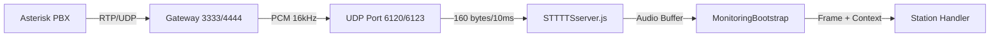
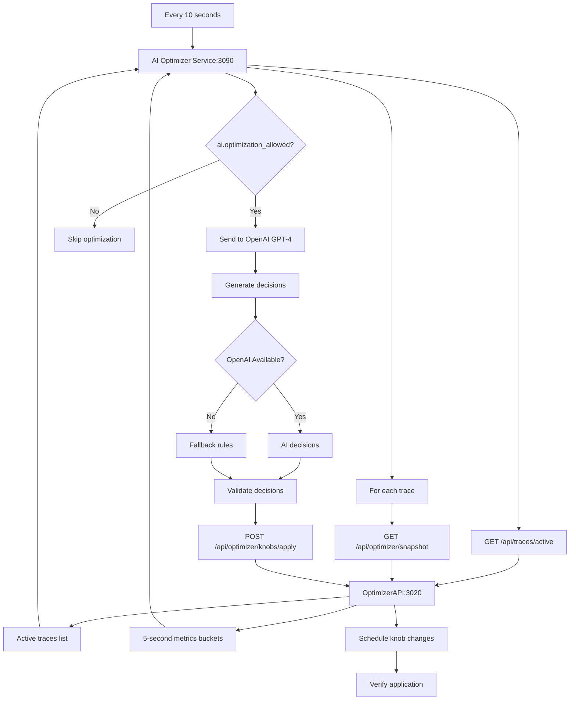

# Data Flow Documentation

## Complete System Data Flow

### 1. Audio Input Flow



### 2. Processing Pipeline Flow

```
┌──────────────────────────────────────────────────────────────────┐
│                       Audio Frame Arrives                        │
│                    (160 bytes = 10ms @ 16kHz)                   │
└────────────────────────────┬─────────────────────────────────────┘
                            │
                            ▼
┌──────────────────────────────────────────────────────────────────┐
│                  STTTTSserver.js receives UDP                    │
│                        Creates context:                          │
│   - trace_id: 'trace_2026-01-12T21-08-07-177Z_3333'           │
│   - started_at: new Date()                                      │
│   - src_extension: '3333'                                       │
│   - sample_rate: 16000                                          │
└────────────────────────────┬─────────────────────────────────────┘
                            │
                            ▼
┌──────────────────────────────────────────────────────────────────┐
│              MonitoringBootstrap.processFrame()                  │
│                  Routes to correct station                       │
└────────────────────────────┬─────────────────────────────────────┘
                            │
                            ▼
┌──────────────────────────────────────────────────────────────────┐
│               Station3_3333_Handler.onFrame()                    │
│                     Custom processing                            │
└────────────────────────────┬─────────────────────────────────────┘
                            │
                            ▼
┌──────────────────────────────────────────────────────────────────┐
│            St_Handler_Generic.process() - PRE tap                │
│          - Apply knobs (gain, filters, etc.)                    │
│          - Collect PRE metrics                                  │
│          - Record PRE audio                                     │
└────────────────────────────┬─────────────────────────────────────┘
                            │
                            ▼
┌──────────────────────────────────────────────────────────────────┐
│                   Audio Processing Logic                         │
│            (Translation pipeline processing)                     │
└────────────────────────────┬─────────────────────────────────────┘
                            │
                            ▼
┌──────────────────────────────────────────────────────────────────┐
│           St_Handler_Generic.process() - POST tap                │
│          - Collect POST metrics                                 │
│          - Record POST audio                                    │
│          - Return processed frame                               │
└──────────────────────────────────────────────────────────────────┘
```

### 3. Metrics Collection Flow

```
Frame Processing (every 10ms)
            │
            ▼
    Metrics Collected
            │
            ▼
    Aggregator.aggregate()
            │
            ▼
    5-Second Bucket Storage
            │
            ├─── Count: N
            ├─── Min: lowest value
            ├─── Max: highest value
            ├─── Sum: total
            ├─── Avg: sum/count
            └─── Last: most recent
            │
            ▼
    Bucket Complete (5 seconds)
            │
            ▼
    Aggregator.flush()
            │
            ▼
    MetricsEmitter.emitBatch()
            │
            ▼
    Queue (max 10,000 items)
            │
            ▼
    Batch Flush (200ms or 100 items)
            │
            ▼
    DatabaseBridge.sendAggregatedMetrics()
            │
            ▼
    PostgreSQL INSERT
```

### 4. Audio Recording Flow

```
Audio Frame
    │
    ▼
AudioRecorder.capture()
    │
    ├─── PRE tap buffer
    └─── POST tap buffer
    │
    ▼
5-Second Bucket Alignment
    │
    ▼
Concatenate frames (500 frames = 5 seconds)
    │
    ▼
Generate WAV header
    │
    ▼
AudioWriter.writeSegment()
    │
    ├─── Write to disk
    │     └── /var/monitoring/audio/traces/{trace_id}/{station}/{tap}/{bucket_ts}.wav
    │
    └─── Index in database
          └── INSERT INTO audio_segments_5s
```

### 5. Database Write Flow

```
┌─────────────────────────────────────────────────────────────────┐
│                     MetricsEmitter Queue                        │
│                    (Bounded: 10,000 items)                     │
└──────────────────────┬──────────────────────────────────────────┘
                      │
                      ▼ Every 200ms or 100 items
┌─────────────────────────────────────────────────────────────────┐
│              DatabaseBridge.sendAggregatedMetrics()             │
└──────────────────────┬──────────────────────────────────────────┘
                      │
                      ▼
┌─────────────────────────────────────────────────────────────────┐
│                        BEGIN TRANSACTION                        │
└──────────────────────┬──────────────────────────────────────────┘
                      │
                      ▼
┌─────────────────────────────────────────────────────────────────┐
│     CRITICAL: Auto-create missing traces (lines 127-169)        │
│                                                                  │
│  for (const [traceId, ctx] of traceContexts) {                 │
│    INSERT INTO traces ... ON CONFLICT DO NOTHING               │
│  }                                                              │
└──────────────────────┬──────────────────────────────────────────┘
                      │
                      ▼
┌─────────────────────────────────────────────────────────────────┐
│                    Bulk INSERT metrics                          │
│           INSERT INTO metrics_agg_5s VALUES (...)              │
│              ON CONFLICT UPDATE (aggregate)                     │
└──────────────────────┬──────────────────────────────────────────┘
                      │
                      ▼
┌─────────────────────────────────────────────────────────────────┐
│                         COMMIT                                   │
└─────────────────────────────────────────────────────────────────┘
```

### 6. AI Optimizer Flow



### 7. Complete Knob Management Flow

```
┌────────────────────────────────────────┐
│      AI Optimizer (Port 3090)          │
│         Every 10 seconds                │
└──────────────┬─────────────────────────┘
              │
              ▼
┌────────────────────────────────────────┐
│    Fetch Active Traces (API:3020)      │
│    GET /api/traces/active              │
└──────────────┬─────────────────────────┘
              │
              ▼
┌────────────────────────────────────────┐
│    Get Metrics Snapshot (per trace)    │
│    GET /api/optimizer/snapshot         │
└──────────────┬─────────────────────────┘
              │
              ▼
┌────────────────────────────────────────┐
│       Check Permission                 │
│    knobs['ai.optimization_allowed']    │
└──────────────┬─────────────────────────┘
              │
              ▼
┌────────────────────────────────────────┐
│        OpenAI Analysis                 │
│    Model: gpt-4-turbo-preview          │
│    Input: Metrics + Current Knobs      │
│    Output: Optimization Decisions      │
└──────────────┬─────────────────────────┘
              │
              ▼
┌────────────────────────────────────────┐
│     Fallback if OpenAI Fails           │
│    Rule-based decisions                │
│    Conservative adjustments            │
└──────────────┬─────────────────────────┘
              │
              ▼
┌────────────────────────────────────────┐
│     Schedule knob update via API       │
│  POST /api/optimizer/knobs/apply       │
│  With idempotency_key                  │
└──────────────┬─────────────────────────┘
              │
              ▼
┌────────────────────────────────────────┐
│   INSERT INTO scheduled_knob_updates   │
│   At next 5-second boundary            │
└──────────────┬─────────────────────────┘
              │
              ▼
┌────────────────────────────────────────┐
│    BucketScheduler timer (1 sec)       │
│    Checks for pending updates          │
└──────────────┬─────────────────────────┘
              │
              ▼
┌────────────────────────────────────────┐
│   Apply at exact bucket time           │
│   (e.g., 21:10:00.000Z)               │
└──────────────┬─────────────────────────┘
              │
              ▼
┌────────────────────────────────────────┐
│     Apply knobs to station             │
│  KnobsResolver.updateStationKnob()     │
└──────────────┬─────────────────────────┘
              │
              ▼
┌────────────────────────────────────────┐
│        Log to knob_events              │
│    Track all changes with reasons      │
└──────────────┬─────────────────────────┘
              │
              ▼
┌────────────────────────────────────────┐
│   Save snapshot to knob_snapshots_5s   │
│    Preserve configuration state        │
└──────────────┬─────────────────────────┘
              │
              ▼
┌────────────────────────────────────────┐
│         Verify Application             │
│  GET /api/optimizer/verify/:key        │
└────────────────────────────────────────┘
```

### 8. AI Decision Flow Details

```
OpenAI GPT-4 Processing
          │
          ▼
┌─────────────────────────────────────┐
│      Prompt Generation              │
│  - Current metrics (RMS, clipping)  │
│  - Current knob values              │
│  - Target goals                     │
│  - Constraints and limits           │
└──────────┬──────────────────────────┘
          │
          ▼
┌─────────────────────────────────────┐
│     OpenAI Analysis (~1-2s)         │
│  Temperature: 0.3                   │
│  Max tokens: 500                    │
│  Response format: JSON              │
└──────────┬──────────────────────────┘
          │
          ▼
┌─────────────────────────────────────┐
│      Decision Generation            │
│  [{                                 │
│    knob: "pcm.input_gain_db",      │
│    recommended_value: 3,            │
│    confidence: 0.85,                │
│    reason: "RMS below target"       │
│  }]                                 │
└──────────┬──────────────────────────┘
          │
          ▼
┌─────────────────────────────────────┐
│      Decision Validation           │
│  - Check knob limits               │
│  - Verify confidence > 0.5         │
│  - Max 5 decisions per cycle       │
└──────────┬──────────────────────────┘
          │
          ▼
┌─────────────────────────────────────┐
│       Apply Decisions              │
└─────────────────────────────────────┘
```

## Data Flow Timing

### Real-time Processing (10ms cycles)
```
T+0ms    : UDP packet arrives
T+0.1ms  : Context creation
T+0.2ms  : Station handler routing
T+0.5ms  : PRE tap metrics/audio
T+1ms    : Audio processing
T+2ms    : POST tap metrics/audio
T+2.5ms  : Aggregator update
T+3ms    : Frame returned
```

### 5-Second Aggregation
```
T+0s     : Bucket starts (aligned to clock)
T+0-5s   : Collect ~500 frames
T+5s     : Bucket complete
T+5.01s  : Flush to MetricsEmitter
T+5.05s  : Queue for database write
T+5.2s   : Batch write to PostgreSQL
```

### Database Write Batching
```
Queue fills → Trigger at 100 items OR 200ms timeout
             ↓
Batch preparation (5ms)
             ↓
Transaction BEGIN
             ↓
Trace creation (10ms)
             ↓
Bulk INSERT (20ms)
             ↓
Transaction COMMIT
             ↓
Total: ~35ms per batch
```

### AI Optimization Timing
```
T+0s     : Optimization cycle starts (every 10s)
T+0.01s  : Fetch active traces
T+0.05s  : Request metrics snapshots
T+0.1s   : Receive metrics data
T+0.15s  : Check permissions
T+0.2s   : Send to OpenAI (if allowed)
T+1.5s   : Receive OpenAI response
T+1.6s   : Validate decisions
T+1.65s  : Schedule knob updates
T+1.7s   : Verify scheduling
T+5s     : Knobs applied at next bucket
T+5.5s   : Verify application success
```

## Data Volume Calculations

### Per Second
- **Frames**: 100 (10ms each)
- **Metrics**: 14 types × 2 taps = 28 data points
- **Audio**: 16,000 samples (32KB raw PCM)

### Per 5-Second Bucket
- **Frames**: 500
- **Metrics**: 28 aggregated values
- **Audio**: 160KB (2 files: PRE + POST)
- **Database Rows**:
  - 28 metrics_agg_5s rows
  - 2 audio_segments_5s rows
  - 1 knob_snapshots_5s row

### Per Trace (3-minute call)
- **Buckets**: 36
- **Metrics**: 1,008 rows
- **Audio Files**: 144 (72 PRE, 72 POST)
- **Storage**: ~5MB audio + 300KB database

## Backpressure Handling

### Queue Monitoring
```
if (queue.length > maxQueueSize * 0.8) {
  // Trigger backpressure warning
  console.warn('Backpressure triggered');
}

if (queue.length >= maxQueueSize) {
  // Drop oldest items
  const dropped = queue.shift();
  stats.dropped++;
}
```

### Failure Recovery
```
try {
  await databaseBridge.sendAggregatedMetrics(batch);
} catch (error) {
  if (queue.length < maxQueueSize) {
    // Requeue for retry
    queue.unshift(...batch);
  } else {
    // Log and drop
    console.error('Failed to send metrics, queue full');
  }
}
```

## Performance Optimization Points

1. **Batch Processing**
   - Metrics batched every 200ms
   - Reduces database round trips by 100x

2. **Connection Pooling**
   - 10 persistent connections
   - Eliminates connection overhead

3. **Async I/O**
   - Non-blocking audio writes
   - Parallel database operations

4. **Memory Management**
   - Bounded queues prevent memory leaks
   - Automatic cleanup of old buckets

5. **Transaction Bundling**
   - Multiple operations per transaction
   - Reduces commit overhead

## Data Consistency Guarantees

1. **Trace Creation**
   - Always created before metrics
   - ON CONFLICT DO NOTHING prevents duplicates

2. **Foreign Key Integrity**
   - All child records reference valid traces
   - CASCADE DELETE maintains consistency

3. **Idempotency**
   - Knob updates use idempotency keys
   - Prevents duplicate applications

4. **Atomic Operations**
   - All database writes in transactions
   - Rollback on any failure

## Monitoring Data Flow Health

### Key Metrics to Monitor
```sql
-- Queue depth
SELECT COUNT(*) FROM information_schema.processlist
WHERE db = 'monitoring_v2' AND command = 'Query';

-- Write throughput
SELECT COUNT(*) as metrics_per_minute
FROM metrics_agg_5s
WHERE bucket_ts > NOW() - INTERVAL '1 minute';

-- Lag detection
SELECT MAX(NOW() - bucket_ts) as max_lag
FROM metrics_agg_5s
WHERE bucket_ts > NOW() - INTERVAL '5 minutes';
```

### Health Check Endpoints
- `GET /api/health` - System health
- `GET /api/traces/active` - Active traces
- `GET /api/metrics/stats` - Metrics statistics

## Error Recovery Flows

### Database Connection Loss
```
Connection Error
    ↓
Retry with exponential backoff
    ↓
If fails after 3 retries
    ↓
Queue metrics locally (up to limit)
    ↓
Alert operators
    ↓
Continue retrying
    ↓
On reconnect: Flush queued data
```

### Audio Write Failure
```
Write Error
    ↓
Queue in memory
    ↓
Retry write
    ↓
If persistent failure
    ↓
Skip audio, continue metrics
    ↓
Log error for manual recovery
```