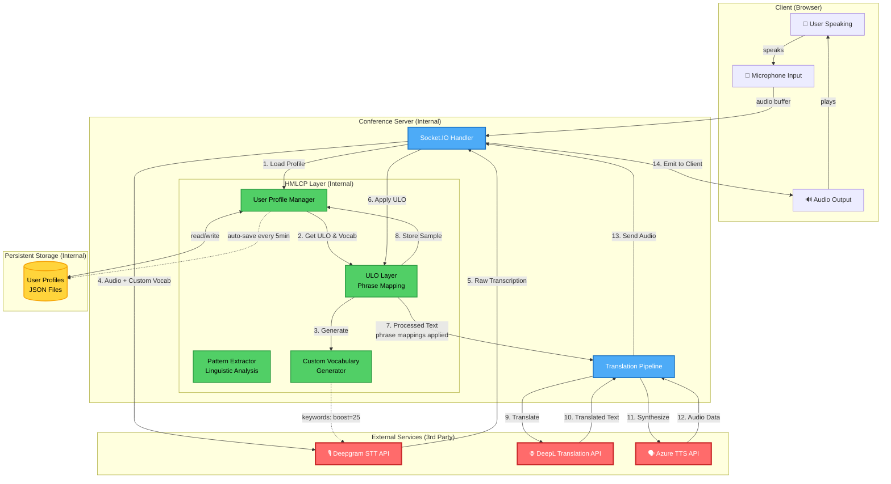

# HMLCP System Architecture

## Complete System Flow Diagram



## Data Flow Details

### 1. Profile Loading Phase
```
User connects → Load or create UserProfile → Initialize ULO Layer → Generate custom vocabulary
```

### 2. Speech-to-Text Phase (Deepgram Integration)
```
Audio Buffer → Custom Vocabulary (keywords) → Deepgram API → Raw Transcription
                    ↓
            [Kubernetes:25, PostgreSQL:25, Azure:25, ...]
```

### 3. HMLCP Processing Phase (ULO Layer)
```
Raw Transcription → ULO.apply() → Processed Transcription
                         ↓
                 Phrase Mappings:
                 "check the thing" → "check the server status"
```

### 4. Translation Phase (DeepL Integration)
```
Processed Text → DeepL API → Translated Text
```

### 5. Text-to-Speech Phase (Azure Integration)
```
Translated Text → Azure TTS API → Audio Data → Client
```

## Component Details

### Internal Components

#### 1. User Profile Manager (`hmlcp/user-profile.js`)
- **Purpose**: Store user-specific linguistic characteristics
- **Data**: Tone, directness, phrase mappings, bias terms, corrections
- **Metrics**: IMR, Calibration Index, correction frequency
- **Persistence**: JSON files in `hmlcp/profiles/`

#### 2. ULO Layer (`hmlcp/ulo-layer.js`)
- **Purpose**: Real-time linguistic adaptation
- **Functions**:
  - `apply(text)` - Apply phrase mappings
  - `learnFromCorrection()` - Update from user feedback
  - `generateCustomVocabulary()` - Create Deepgram keywords
- **Processing**: Phrase mapping, contextual fixes, bias handling

#### 3. Pattern Extractor (`hmlcp/pattern-extractor.js`)
- **Purpose**: Analyze user linguistic patterns
- **Analyzes**: Token frequency, sentence structure, tone, directness
- **Output**: Profile characteristics for calibration

### External Services

#### 1. Deepgram STT API
- **Integration Point**: `transcribeAudio()` in conference-server.js:87
- **HMLCP Enhancement**: Custom vocabulary keywords (boost=25)
- **Input**: Audio buffer + keywords array
- **Output**: Transcription + confidence score

#### 2. DeepL Translation API
- **Integration Point**: `translateText()` in conference-server.js:119
- **HMLCP Enhancement**: Receives ULO-processed text
- **Input**: Processed transcription
- **Output**: Translated text

#### 3. Azure TTS API
- **Integration Point**: `synthesizeSpeech()` in conference-server.js:147
- **HMLCP Enhancement**: None (receives final translated text)
- **Input**: Translated text
- **Output**: MP3 audio buffer

## API Endpoints

### HMLCP Management APIs (Internal)

```
GET  /api/hmlcp/profile/:userId/:language
     → Get user profile statistics

POST /api/hmlcp/correction
     → Submit correction for learning
     Body: { userId, language, rawInput, correctedIntent }

POST /api/hmlcp/analyze
     → Analyze linguistic patterns
     Body: { userId, language }

GET  /api/hmlcp/vocabulary/:userId/:language
     → Get custom vocabulary for user

POST /api/hmlcp/save
     → Manually save profile
     Body: { userId, language }
```

## File Structure

```
realtime-translation-app/
├── conference-server.js          [Main server - Integration point]
├── hmlcp/
│   ├── index.js                  [Module exports]
│   ├── user-profile.js           [Profile management]
│   ├── ulo-layer.js              [Real-time adaptation]
│   ├── pattern-extractor.js      [Linguistic analysis]
│   └── profiles/                 [Persistent storage]
│       ├── testuser_en.json
│       └── testuser2_en.json
└── HMLCP.md                      [Specification document]
```

## Key Integration Points

### conference-server.js

```javascript
// Line 87: Deepgram with custom vocabulary
async function transcribeAudio(audioBuffer, language, customVocab = [])

// Line 318-323: Profile loading before transcription
const { profile, uloLayer, patternExtractor } = await getUserProfile(...)
const customVocab = uloLayer.generateCustomVocabulary()

// Line 335-339: Pass custom vocab to Deepgram
const { text: transcription } = await transcribeAudio(
  Buffer.from(audioBuffer),
  participant.language,
  customVocab  // ← HMLCP integration
)

// Line 366: Apply ULO processing
const processedTranscription = uloLayer.apply(transcription)

// Line 400-404: Send processed text to DeepL
const translatedText = await translateText(
  finalTranscription,  // ← ULO-processed
  participant.language,
  targetParticipant.language
)
```

## Performance Characteristics

- **Profile Loading**: ~10ms (cached in memory after first load)
- **ULO Processing**: <1ms (string replacement operations)
- **Custom Vocabulary**: Generated once per session, no overhead
- **Auto-save**: Every 5 minutes, async operation
- **Pattern Analysis**: On-demand via API, ~50-100ms for typical profile

## Security & Privacy

- **Local Storage**: All profiles stored locally on server
- **No Cloud Sync**: Profiles never leave the server
- **User Isolation**: Each user has separate profile file
- **No PII Required**: Profiles identified by username only

## Future Enhancements

1. **Real-time Pattern Analysis**: Automatically analyze patterns after N samples
2. **Multi-language Profiles**: Separate characteristics per language
3. **Shared Vocabulary**: Organization-wide technical term dictionaries
4. **Active Learning**: Prompt users for corrections on low-confidence transcriptions
