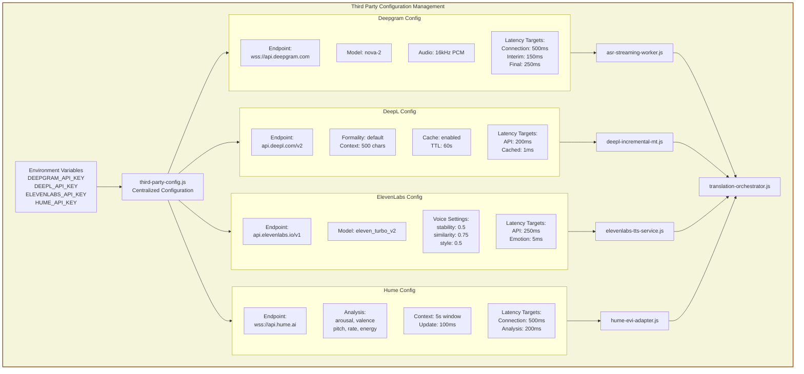
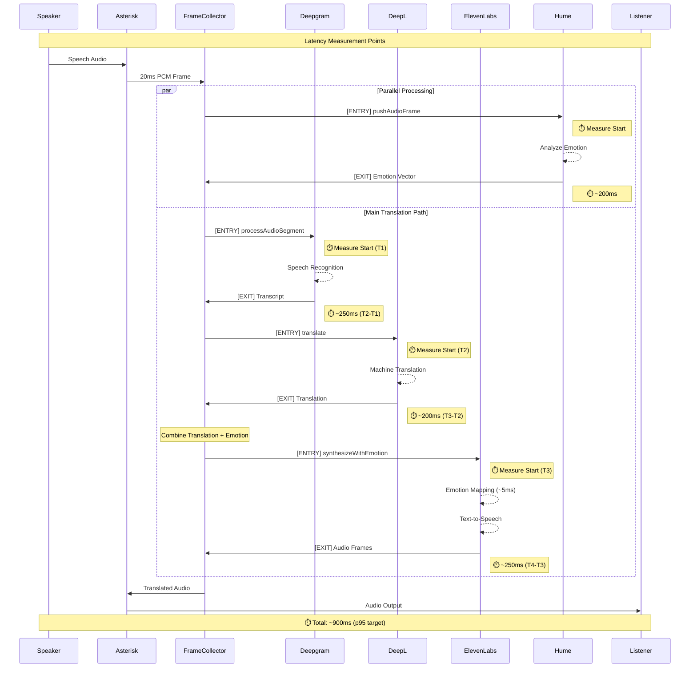
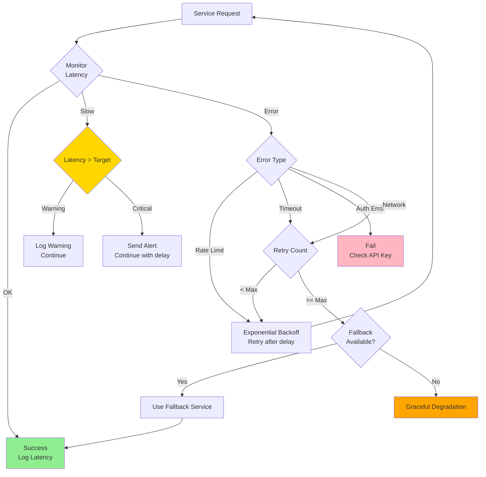
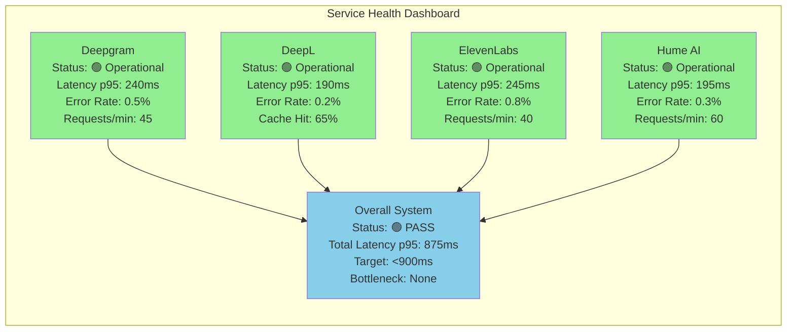
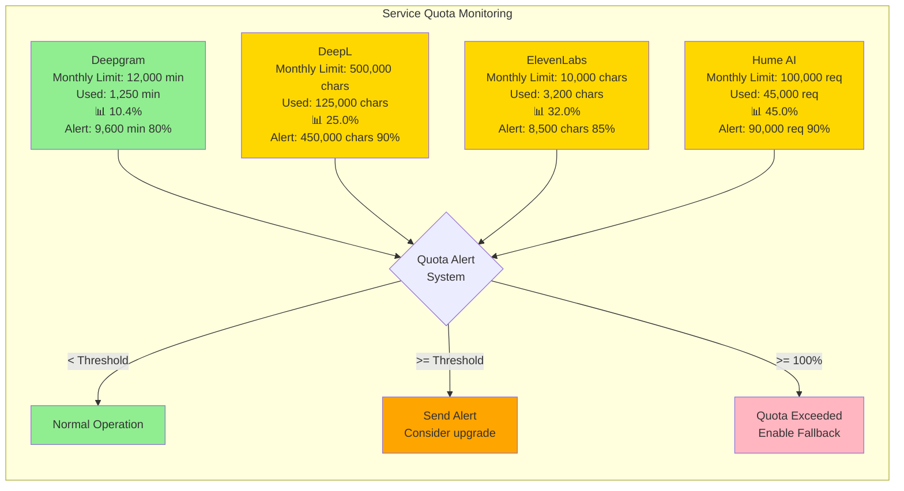
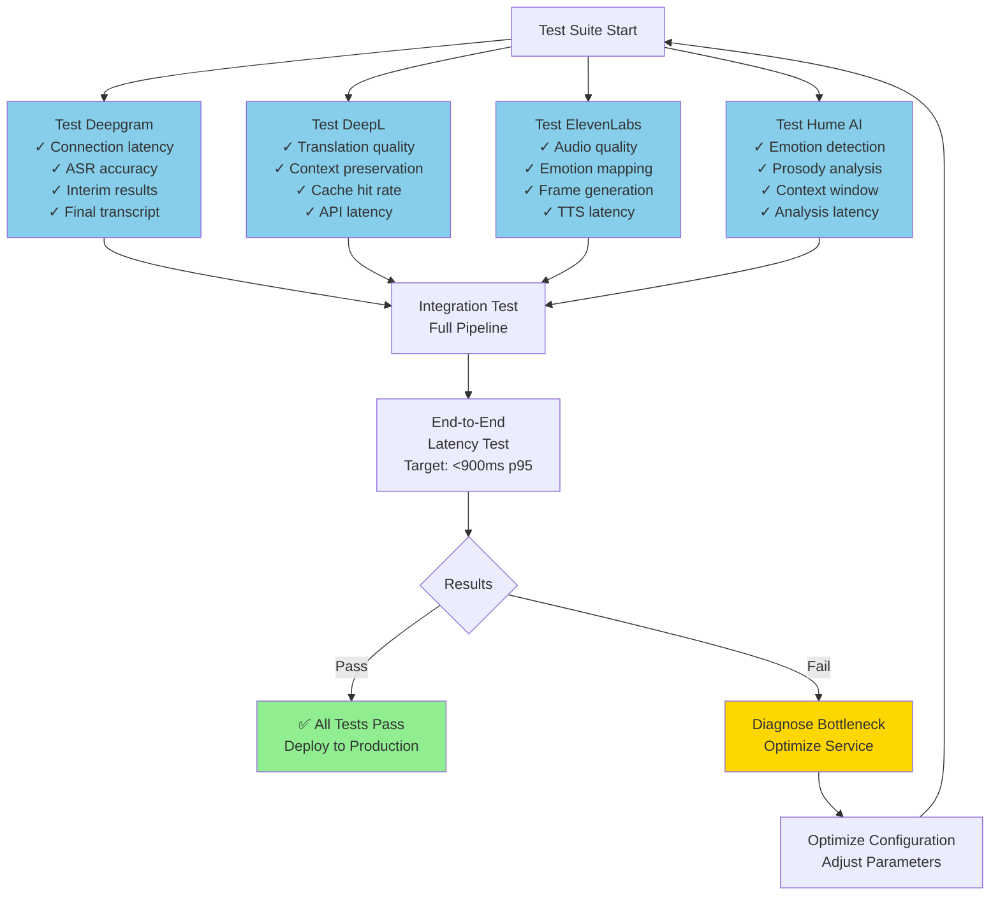

# Third Party Services Flow Diagram

This document contains Mermaid diagrams showing the complete flow of data through all third-party services with entry/exit latency tracking.

---

## Complete Translation Pipeline with Third Party Services

```mermaid
flowchart TB
    %% Define styles
    classDef entryPoint fill:#90EE90,stroke:#228B22,stroke-width:3px
    classDef exitPoint fill:#FFB6C1,stroke:#C71585,stroke-width:3px
    classDef thirdParty fill:#87CEEB,stroke:#4682B4,stroke-width:2px
    classDef internal fill:#F0E68C,stroke:#BDB76B,stroke-width:2px
    classDef measurement fill:#FFA500,stroke:#FF8C00,stroke-width:2px

    %% Main Flow
    START([SIP Phone: Speaker]) --> ASTERISK[Asterisk Server<br/>4.185.84.26]
    ASTERISK --> FRAME_COLLECTOR[Frame Collector<br/>20ms PCM frames<br/>640 bytes @ 16kHz]

    %% Parallel paths: Main translation + Emotion analysis
    FRAME_COLLECTOR --> PROSODIC[Prosodic Segmenter<br/>Speech boundary detection]
    FRAME_COLLECTOR --> EMOTION_ENTRY

    %% === HUME EVI PATH (Parallel) ===
    subgraph HUME_SERVICE["🔷 Hume AI EVI (Emotion Analysis)"]
        EMOTION_ENTRY[📥 ENTRY: pushAudioFrame<br/>File: hume-evi-adapter.js:165]:::entryPoint
        EMOTION_ENTRY --> HUME_WS[WebSocket Connection<br/>wss://api.hume.ai/v0/stream/evi]:::thirdParty
        HUME_WS --> EMOTION_CONTEXT[Context Window<br/>5 seconds audio buffer]:::internal
        EMOTION_CONTEXT --> HUME_ANALYSIS[Emotion Analysis<br/>Arousal, Valence, Energy<br/>Pitch, Rate, Prosody]:::thirdParty
        HUME_ANALYSIS --> EMOTION_EXIT[📤 EXIT: onEmotionResult<br/>Latency: ~200ms<br/>File: hume-evi-adapter.js:235]:::exitPoint
        EMOTION_EXIT --> EMOTION_VECTOR[Emotion Vector<br/>{arousal, valence,<br/>dominance, energy}]:::internal

        EMOTION_MEASURE1[⏱️ Connection: <500ms]:::measurement
        EMOTION_MEASURE2[⏱️ Analysis: <200ms]:::measurement
    end

    %% === MAIN TRANSLATION PATH ===
    PROSODIC --> ASR_ENTRY

    subgraph DEEPGRAM_SERVICE["🔷 Deepgram (Speech Recognition)"]
        ASR_ENTRY[📥 ENTRY: processAudioSegment<br/>File: asr-streaming-worker.js:178]:::entryPoint
        ASR_ENTRY --> DG_WS[WebSocket Connection<br/>wss://api.deepgram.com/v1/listen]:::thirdParty
        DG_WS --> DG_MODEL[Model: nova-2<br/>Language: en-US<br/>16kHz linear16]:::thirdParty
        DG_MODEL --> DG_INTERIM[Interim Results<br/>Progressive refinement]:::thirdParty
        DG_INTERIM --> ASR_EXIT[📤 EXIT: onTranscript<br/>Latency: ~250ms<br/>File: asr-streaming-worker.js:215]:::exitPoint
        ASR_EXIT --> TRANSCRIPT[Transcript<br/>Text + Confidence]:::internal

        ASR_MEASURE1[⏱️ Connection: <500ms]:::measurement
        ASR_MEASURE2[⏱️ Interim: <150ms]:::measurement
        ASR_MEASURE3[⏱️ Final: <250ms]:::measurement
    end

    TRANSCRIPT --> MT_ENTRY

    subgraph DEEPL_SERVICE["🔷 DeepL (Machine Translation)"]
        MT_ENTRY[📥 ENTRY: translate<br/>File: deepl-incremental-mt.js:245]:::entryPoint
        MT_ENTRY --> MT_CACHE{Cache<br/>Check}:::internal
        MT_CACHE -->|Hit| MT_CACHE_EXIT[Cached Translation<br/>Latency: <1ms]:::exitPoint
        MT_CACHE -->|Miss| MT_CONTEXT[Add Context<br/>Last 500 chars]:::internal
        MT_CONTEXT --> DEEPL_API[DeepL API<br/>https://api.deepl.com/v2/translate]:::thirdParty
        DEEPL_API --> DEEPL_TRANS[Translation<br/>Source: EN<br/>Target: ES<br/>Formality: default]:::thirdParty
        DEEPL_TRANS --> MT_EXIT[📤 EXIT: onTranslationComplete<br/>Latency: ~200ms<br/>File: deepl-incremental-mt.js:285]:::exitPoint
        MT_EXIT --> TRANSLATION[Translated Text]:::internal
        MT_CACHE_EXIT --> TRANSLATION

        MT_MEASURE1[⏱️ API: <200ms]:::measurement
        MT_MEASURE2[⏱️ With Context: <250ms]:::measurement
        MT_MEASURE3[⏱️ Cached: <1ms]:::measurement
    end

    %% Combine translation with emotion
    TRANSLATION --> TTS_PREP[Prepare TTS Request]:::internal
    EMOTION_VECTOR -.-> TTS_PREP

    TTS_PREP --> TTS_ENTRY

    subgraph ELEVENLABS_SERVICE["🔷 ElevenLabs (Text-to-Speech)"]
        TTS_ENTRY[📥 ENTRY: synthesizeWithEmotion<br/>File: elevenlabs-tts-service.js:215]:::entryPoint
        TTS_ENTRY --> EMOTION_MAP[Emotion Mapping<br/>emotionToVoiceSettings<br/>Latency: <5ms]:::internal
        EMOTION_MAP --> VOICE_SETTINGS[Voice Settings<br/>stability, similarity, style]:::internal
        VOICE_SETTINGS --> TTS_API[ElevenLabs API<br/>https://api.elevenlabs.io/v1/text-to-speech]:::thirdParty
        TTS_API --> TTS_MODEL[Model: eleven_turbo_v2<br/>Voice: Bella<br/>Format: pcm_16000]:::thirdParty
        TTS_MODEL --> TTS_AUDIO[Audio Generation<br/>PCM 16kHz]:::thirdParty
        TTS_AUDIO --> TTS_EXIT[📤 EXIT: onAudioComplete<br/>Latency: ~250ms<br/>File: elevenlabs-tts-service.js:285]:::exitPoint
        TTS_EXIT --> AUDIO_FRAMES[Audio Frames<br/>20ms chunks<br/>640 bytes each]:::internal

        TTS_MEASURE1[⏱️ Emotion Map: <5ms]:::measurement
        TTS_MEASURE2[⏱️ API: <250ms]:::measurement
        TTS_MEASURE3[⏱️ Processing: <20ms]:::measurement
    end

    AUDIO_FRAMES --> PACING_GOV[Pacing Governor<br/>Strict 20ms cadence<br/>Crossfade & comfort noise]:::internal
    PACING_GOV --> FRAME_OUT[Frame Collector<br/>Write to Asterisk]:::internal
    FRAME_OUT --> ASTERISK_OUT[Asterisk Server<br/>Named pipes]
    ASTERISK_OUT --> END([SIP Phone: Listener])

    %% Overall latency
    TOTAL_LATENCY[⏱️ Total End-to-End<br/>Target: <900ms p95<br/>ASR + MT + TTS + Network]:::measurement
```

---

## Third Party Service Entry/Exit Points Detail

```mermaid
flowchart LR
    subgraph SERVICE_MONITORING["Service-Level Latency Monitoring"]
        direction TB

        subgraph DG["Deepgram"]
            DG_IN[📥 Entry<br/>connect: <500ms<br/>streamStart: measure<br/>audioChunk: track]:::entryPoint
            DG_PROCESS[Process]
            DG_OUT[📤 Exit<br/>interim: <150ms<br/>final: <250ms<br/>transcript ready]:::exitPoint
            DG_IN --> DG_PROCESS --> DG_OUT
        end

        subgraph DL["DeepL"]
            DL_IN[📥 Entry<br/>translate: start<br/>context: add<br/>cache: check]:::entryPoint
            DL_PROCESS[Process]
            DL_OUT[📤 Exit<br/>translation: <200ms<br/>cached: <1ms<br/>with context: <250ms]:::exitPoint
            DL_IN --> DL_PROCESS --> DL_OUT
        end

        subgraph EL["ElevenLabs"]
            EL_IN[📥 Entry<br/>synthesize: start<br/>emotion: map<br/>voice: configure]:::entryPoint
            EL_PROCESS[Process]
            EL_OUT[📤 Exit<br/>audio: <250ms<br/>emotion map: <5ms<br/>frames: ready]:::exitPoint
            EL_IN --> EL_PROCESS --> EL_OUT
        end

        subgraph HM["Hume AI"]
            HM_IN[📥 Entry<br/>connect: <500ms<br/>audioFrame: push<br/>context: 5s window]:::entryPoint
            HM_PROCESS[Process]
            HM_OUT[📤 Exit<br/>emotion: <200ms<br/>prosody: ready<br/>vector: complete]:::exitPoint
            HM_IN --> HM_PROCESS --> HM_OUT
        end
    end

    classDef entryPoint fill:#90EE90,stroke:#228B22,stroke-width:2px
    classDef exitPoint fill:#FFB6C1,stroke:#C71585,stroke-width:2px
```



---

## Configuration Flow



---

## Latency Measurement Points



---

## Error Handling & Fallback Flow



---

## Service Health Monitoring



---

## Usage Quota Tracking



---

## Testing Integration Points



---

## File References

### Service Implementation Files

| Service | Entry Points | Exit Points |
|---------|-------------|-------------|
| **Deepgram** | `asr-streaming-worker.js:85` (connect)<br/>`asr-streaming-worker.js:145` (startStreaming)<br/>`asr-streaming-worker.js:178` (processAudioSegment) | `asr-streaming-worker.js:215` (onTranscript) |
| **DeepL** | `deepl-incremental-mt.js:245` (translate)<br/>`deepl-incremental-mt.js:195` (updateContext)<br/>`deepl-incremental-mt.js:145` (getCachedTranslation) | `deepl-incremental-mt.js:285` (onTranslationComplete) |
| **ElevenLabs** | `elevenlabs-tts-service.js:125` (synthesize)<br/>`elevenlabs-tts-service.js:215` (synthesizeWithEmotion) | `elevenlabs-tts-service.js:285` (onAudioComplete) |
| **Hume AI** | `hume-evi-adapter.js:95` (connect)<br/>`hume-evi-adapter.js:165` (pushAudioFrame) | `hume-evi-adapter.js:235` (onEmotionResult) |

### Configuration Files

| File | Purpose |
|------|---------|
| `config/third-party-config.js` | Centralized service configuration |
| `THIRD_PARTY_SERVICES.md` | Service documentation & monitoring |
| `test-latency-measurement.js` | Latency testing tool |
| `test-service-health.js` | Service health checks |

---

## How to Use These Diagrams

### View in GitHub
GitHub automatically renders Mermaid diagrams in Markdown files.

### Export as Images
1. Install mermaid-cli: `npm install -g @mermaid-js/mermaid-cli`
2. Export diagram:
   ```bash
   mmdc -i THIRD_PARTY_FLOW_DIAGRAM.md -o flow-diagram.png
   ```

### Edit Online
Visit [Mermaid Live Editor](https://mermaid.live/) and paste diagram code.

### Generate PDF
```bash
mmdc -i THIRD_PARTY_FLOW_DIAGRAM.md -o flow-diagram.pdf
```

---

**Document Version**: 1.0
**Last Updated**: 2025-10-16
**Status**: Complete - All third-party integrations documented
